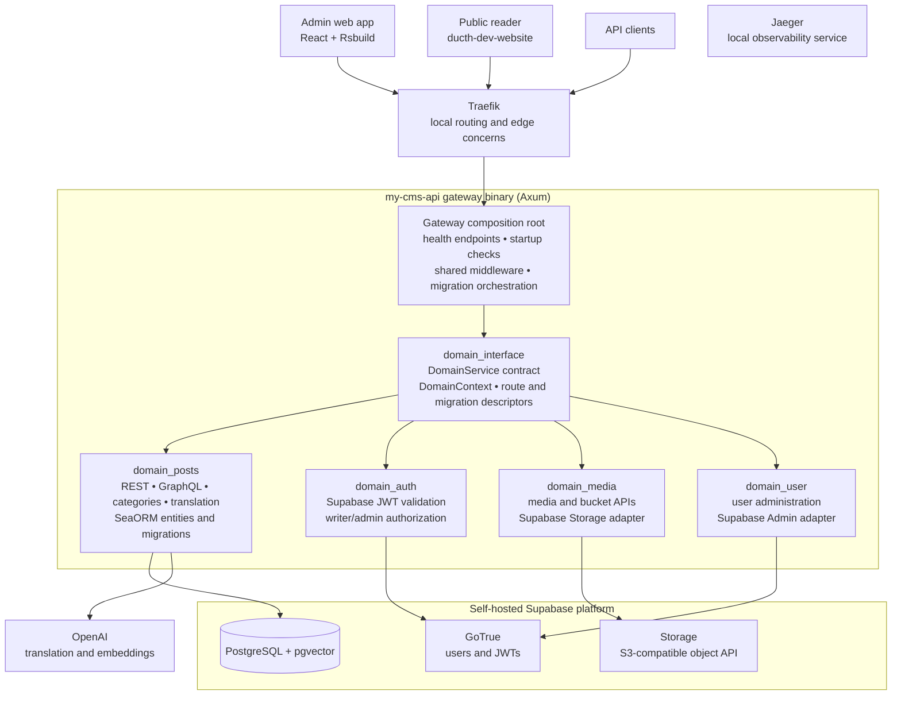

[](https://github.com/doitsu2014/my-cms/actions/workflows/ci-my-cms.yml)
[](https://codecov.io/gh/doitsu2014/my-cms)
[](https://coveralls.io/github/doitsu2014/my-cms?branch=main)

# My-CMS

My-CMS is a self-hosted, API-first publishing platform. It provides a Rust gateway API, a React administrative console, a public reader website, and a self-hosted Supabase platform for PostgreSQL, authentication, and object storage.

The current backend is a **pluggable domain-service workspace**. One deployable `my-cms-api` binary composes the posts, authentication, media, and user domains behind consistent HTTP, authorization, migration, and tracing boundaries.

## What is included

- **Content API** — REST endpoints for posts, categories, media, and users, plus public immutable and authenticated mutable GraphQL endpoints.
- **Editorial workflow** — a React 19 admin interface with DaisyUI, Tailwind CSS, TipTap, Apollo Client, Supabase authentication, and shared `editor-prose` rendering.
- **Public reader** — the `ducth-dev-website` React application reads the public GraphQL API and renders the same prose package used by the admin.
- **Domain-owned backend** — posts own content, categories, tags, translations, GraphQL contribution, and canonical migrations; media owns Supabase Storage access; users own Supabase Admin operations; auth owns JWT verification.
- **AI translation** — HTML-aware post translation uses OpenAI and can reuse cached or vector-similar results. See the [AI platform guide](docs/ai-platform.md).
- **Self-hosted platform** — Docker Compose runs Supabase (PostgreSQL + pgvector, GoTrue, Storage, Kong, Studio, and supporting services), Traefik, Jaeger, the API, and both web apps.

## Architecture


```mermaid
flowchart TB
    Admin["Admin web app\nReact + Rsbuild"]
    Reader["Public reader\nducth-dev-website"]
    Client["API clients"]
    Proxy["Traefik\nlocal routing and edge concerns"]

    Admin --> Proxy
    Reader --> Proxy
    Client --> Proxy
    Proxy --> Gateway

    subgraph API["my-cms-api gateway binary (Axum)"]
        Gateway["Gateway composition root\nhealth endpoints • startup checks\nshared middleware • migration orchestration"]
        Contract["domain_interface\nDomainService contract\nDomainContext • route and migration descriptors"]
        Posts["domain_posts\nREST • GraphQL • categories • translation\nSeaORM entities and migrations"]
        Auth["domain_auth\nSupabase JWT validation\nwriter/admin authorization"]
        Media["domain_media\nmedia and bucket APIs\nSupabase Storage adapter"]
        Users["domain_user\nuser administration\nSupabase Admin adapter"]

        Gateway --> Contract
        Contract --> Posts
        Contract --> Auth
        Contract --> Media
        Contract --> Users
    end

    subgraph Supabase["Self-hosted Supabase platform"]
        Database[("PostgreSQL + pgvector")]
        GoTrue["GoTrue\nusers and JWTs"]
        Storage["Storage\nS3-compatible object API"]
    end

    Posts --> Database
    Posts --> OpenAI["OpenAI\ntranslation and embeddings"]
    Auth --> GoTrue
    Users --> GoTrue
    Media --> Storage
    Jaeger["Jaeger\nlocal observability service"]
```

### How requests are composed

At startup, the gateway creates one database connection and builds immutable and mutable GraphQL schemas. It asks each registered `DomainService` for route registrations, then merges them into three route groups:

| Route group | Who can use it | Examples |
| --- | --- | --- |
| Public | Anyone | `/health`, public media, `/posts/graphql/immutable` |
| Protected | CMS writers and administrators with a valid Supabase JWT | post and category CRUD, translation, `/posts/graphql/mutable`, media operations |
| Administrator | CMS administrators with a valid Supabase JWT | user management and media bucket management |

The gateway applies cross-cutting authentication and cookie handling once, rather than embedding them in every domain router. It also collects domain migration descriptors and runs their migrations against the shared connection. The operator CLI is available as `my-cms-api migrate up`, `down`, `status`, or `--list`.

For the detailed source map and API route topology, see [API architecture](docs/api-architecture.md).

## Repository layout

```text
my-cms/
├── apps/
│   ├── api/                       Rust Cargo workspace
│   │   ├── gateway/               `my-cms-api` composition root and migration CLI
│   │   ├── domain_interface/      Stable contract for domain services
│   │   ├── domain_posts/          Content, GraphQL, AI translation, migrations
│   │   ├── domain_auth/           Supabase JWT authentication
│   │   ├── domain_media/          Media and bucket service
│   │   └── domain_user/           User administration service
│   ├── web/                       React administrative application
│   └── ducth-dev-website/         Public reader website
├── packages/editor-prose/         Shared rich-text presentation package
├── deployments/
│   ├── docker-swarm/              Local Supabase, apps, and Traefik Compose stacks
│   └── k8s/                       Helm charts
├── docs/                          Architecture, API, and operational documentation
└── openspec/                      Versioned capability specifications and change records
```

## Technology

| Area | Current implementation |
| --- | --- |
| API | Rust, Axum 0.8, Tokio, SeaORM 1.1, async-graphql 7 |
| Backend structure | Gateway composition root plus `DomainService` implementations |
| Data | PostgreSQL + pgvector through self-hosted Supabase |
| Authentication | Supabase GoTrue JWTs, with writer and administrator role gates |
| Media | Supabase Storage API and image delivery endpoints |
| Admin | React 19, TypeScript, Rsbuild, DaisyUI 5, Tailwind CSS 4, TipTap, Apollo Client |
| Public web | React 19, Rsbuild, React Router, i18next, Express production server |
| Operations | Docker Compose, Traefik, Jaeger, GitHub Actions |

## Run locally

The local environment uses three independent Compose stacks connected through the external `supabase_network`: Supabase, application services, and Traefik. The reset scripts are intended for local development; a full reset removes the relevant local volumes.

```bash
cd deployments/docker-swarm

# One time: create the shared Docker network.
./bootstrap.sh

# Create local configuration files and set real development secrets.
cp supabase/.env.example supabase/.env
cp apps/.env.example apps/.env
cp traefik/.env.example traefik/.env

# Start Supabase and the reverse proxy, then the API, admin, reader, and Jaeger.
./supabase/reset.sh
./apps/reset.sh
```

The shared `POSTGRES_PASSWORD`, `JWT_SECRET`, `ANON_KEY`, and `SERVICE_ROLE_KEY` values in `supabase/.env` and `apps/.env` must match. See the [local Docker stack guide](deployments/docker-swarm/README.md) for prerequisites, restart-only commands, direct port exposure, and routing details.

| Local address | Service |
| --- | --- |
| `http://localhost:8989` | My-CMS API |
| `http://localhost:3002` | Admin web app |
| `http://localhost:3001` | Public reader website |
| `http://localhost:16686` | Jaeger UI |
| `http://localhost:8080` | Traefik dashboard |

## Develop and verify

Backend commands run from `apps/api`; frontend commands run from their application directory.

```bash
# API workspace
cd apps/api
cargo check
cargo test
cargo fmt -- --check
cargo clippy

# Inspect or apply domain-owned migrations through the gateway binary
cargo run -p gateway --bin my-cms-api -- migrate status
cargo run -p gateway --bin my-cms-api -- migrate up

# Admin frontend
pnpm --dir ../web test
pnpm --dir ../web build

# Public reader
pnpm --dir ../ducth-dev-website test
pnpm --dir ../ducth-dev-website build
```

## Documentation and change process

- [API architecture](docs/api-architecture.md) — workspace, gateway, and domain ownership details.
- [AI translation platform](docs/ai-platform.md) — translation behavior, reuse strategy, and jobs.
- [Postman collection](docs/postman_collection/) — REST and GraphQL request examples.
- [Local Docker stack](deployments/docker-swarm/README.md) — Compose setup and operational commands.
- [OpenSpec](openspec/) — capability specifications and the proposal → design → task → verification workflow.
- [Changelog](CHANGELOG.md) — released changes.

## License

Released under the terms of the [LICENSE](LICENSE) file (MIT OR Apache-2.0).
