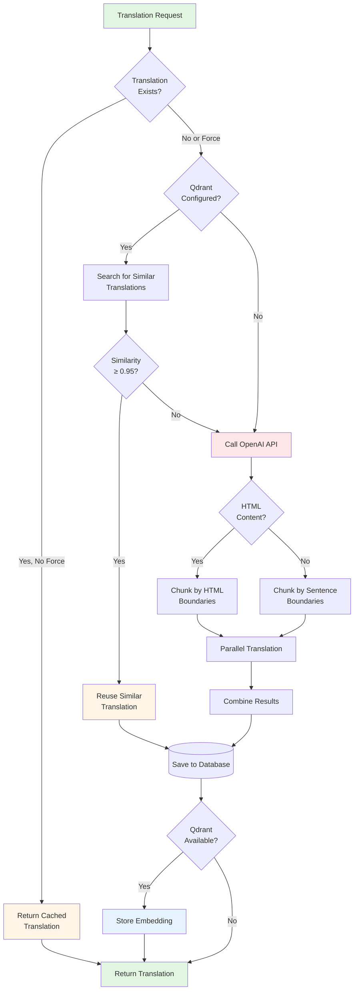
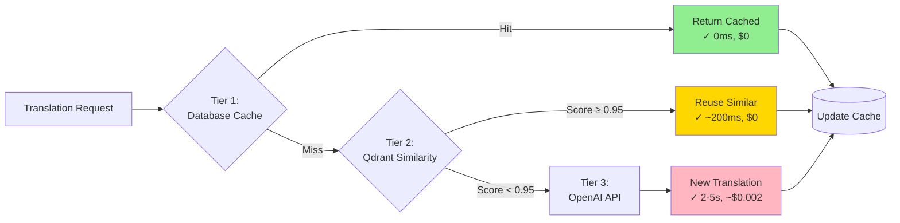
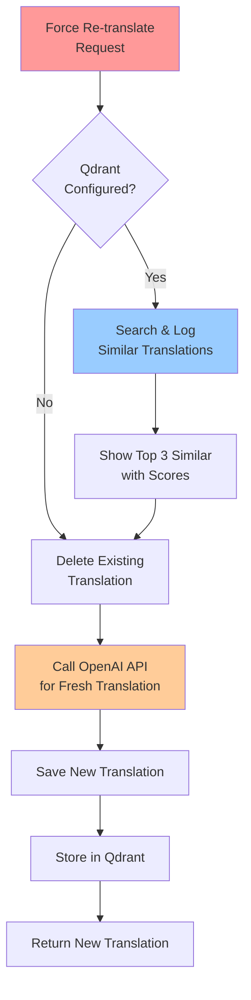

# AI Translation Service

## Overview

The AI Translation Service provides intelligent, cost-efficient post translation powered by OpenAI's GPT-4o-mini model. The service features a sophisticated 3-tier lookup strategy that minimizes API costs while maintaining high-quality translations.

### Key Features

- **3-Tier Lookup Strategy**: Database cache → Qdrant similarity search → OpenAI API
- **Smart Translation Reuse**: Automatically reuses highly similar existing translations (≥95% similarity)
- **HTML-Aware Processing**: Preserves HTML structure when translating markup content
- **Background Processing**: Non-blocking execution for large content
- **Vector Database Integration**: Qdrant for semantic search and similarity matching
- **Force Re-translation**: Override cache with similarity checking for quality improvements

## Architecture

### Overall Translation Flow



### 3-Tier Lookup Strategy



### Force Re-translate Flow



## Features

### 1. Translation Caching

The service automatically checks for existing translations before making API calls:

- **Cache Hit**: Returns immediately with 0 API cost and ~0ms latency
- **Cache Miss**: Proceeds to Qdrant similarity check or OpenAI API
- **Override**: Use `forceRetranslate: true` to bypass cache

### 2. Smart Translation Reuse

When a new translation is requested, the system searches Qdrant for semantically similar translations:

**Automatic Reuse Criteria:**
- Similarity score ≥ 0.95 (95% similar)
- Same target language
- Different source post (excludes self-matching)

**Benefits:**
- **Cost Savings**: 5-15% reduction in API calls (up to 50% for repetitive content)
- **Faster Response**: ~200-500ms vs 2-5 seconds for new translations
- **Consistency**: Similar content gets consistent translations
- **Transparency**: Response includes `reusedFromSimilar` metadata

**Configuration:**

```rust
// Location: application_core/src/commands/ai/translate/translate_handler.rs
const SIMILARITY_REUSE_THRESHOLD: f32 = 0.95;
```

**Threshold Recommendations:**
- **Higher (0.98-0.99)**: More conservative, nearly identical content only
- **0.95 (Recommended)**: Good balance between savings and quality
- **Lower (0.90-0.94)**: More aggressive, may sacrifice some accuracy

### 3. HTML-Aware Processing

Automatically detects and handles HTML content:

- Preserves HTML structure and tags during translation
- Only translates text content within tags
- Chunks at block-level element boundaries (`</p>`, `</div>`, `</section>`)
- Never breaks HTML tags across chunks

### 4. Content Chunking

Handles large content by splitting intelligently:

**Plain Text:**
- Splits at sentence boundaries (`.`, `!`, `?`)
- Maximum chunk size: 1500 characters
- Maintains sentence integrity

**HTML Content:**
- Splits at block-level element boundaries
- Preserves tag structure
- Maximum chunk size: 1500 characters

**Parallel Processing:**
- Processes chunks concurrently for speed
- Combines results maintaining original order
- Enhanced logging shows per-chunk progress

### 5. Background Processing

Non-blocking execution mode for large content:

```bash
POST /posts/{post_id}/translate/background
```

- Returns immediately with `status: "processing"`
- Ideal for batch operations or large posts
- Uses `tokio::spawn` for async execution
- Comprehensive logging for monitoring

### 6. Quality Improvements

Recent enhancements for long-form content:

**Token Limits:**
- Increased `MAX_TOKENS_PER_REQUEST` from 3000 to 8000 tokens
- Prevents truncation of long translations
- Supports GPT-4o-mini's 16,384 token output capacity

**Optimized Chunking:**
- Reduced `MAX_CHUNK_SIZE` from 2000 to 1500 characters
- Ensures input + output fit comfortably within token limits
- More chunks but complete translations

**Enhanced Prompts:**
- Explicit directive: "Translate the ENTIRE content provided, do not truncate or summarize"
- Prevents AI from condensing long content

**Comprehensive Logging:**
```
Translating large content: 15234 characters split into 11 chunks (max 1500 chars per chunk)
Spawning translation task for chunk 1/11 (1498 characters, HTML)
✓ Completed translation for chunk 1 (1498 chars → 1623 chars)
✓ All 11 chunks translated successfully, combining results
✓ Final translation complete: 16789 characters (from original 15234 characters)
```

## Configuration

### Environment Variables

```env
# Required: OpenAI API key
OPENAI_API_KEY=sk-proj-...

# Optional: Qdrant vector database for semantic search
QDRANT_URL=http://localhost:6334
```

### Docker Setup for Qdrant

```bash
docker run -p 6333:6333 -p 6334:6334 \
    -v $(pwd)/qdrant_storage:/qdrant/storage:z \
    qdrant/qdrant
```

**Important Notes:**
- Qdrant has two ports: 6333 (HTTP API) and 6334 (gRPC)
- This application uses **gRPC port 6334**
- Use `QDRANT_URL=http://localhost:6334` (not 6333)

### Model Configuration

```rust
// Model: GPT-4o-mini (cost-effective)
// Temperature: 0.3 (deterministic translations)
// Max output tokens: 8000
// Embedding model: text-embedding-3-small (1536 dimensions)
```

## API Documentation

### Authentication

All endpoints require authentication with `my-headless-cms-writer` role via Keycloak.

### Endpoint 1: Translate Post (Synchronous)

Translates a post and waits for completion before returning.

**Endpoint:** `POST /posts/{post_id}/translate`

**Request:**
```json
{
  "targetLanguage": "VI",
  "forceRetranslate": false
}
```

**Fields:**
- `targetLanguage` (string, required): Target language code (e.g., "VI", "ES", "FR")
- `forceRetranslate` (boolean, optional, default: false): Forces re-translation with similarity checking

**Response (New Translation):**
```json
{
  "data": {
    "translationId": "550e8400-e29b-41d4-a716-446655440000",
    "status": "completed"
  },
  "isSuccess": true,
  "errors": []
}
```

**Response (Reused Translation - Cost Savings!):**
```json
{
  "data": {
    "translationId": "550e8400-e29b-41d4-a716-446655440000",
    "status": "completed",
    "reusedFromSimilar": {
      "sourceTranslationId": "750e8400-e29b-41d4-a716-446655440002",
      "similarityScore": 0.972,
      "sourcePostId": "850e8400-e29b-41d4-a716-446655440003"
    }
  },
  "isSuccess": true,
  "errors": []
}
```

**Example cURL:**
```bash
# Standard translation
curl -X POST "http://localhost:8989/posts/{post_id}/translate" \
  -H "Authorization: Bearer YOUR_TOKEN" \
  -H "Content-Type: application/json" \
  -d '{"targetLanguage": "VI"}'

# Force re-translation
curl -X POST "http://localhost:8989/posts/{post_id}/translate" \
  -H "Authorization: Bearer YOUR_TOKEN" \
  -H "Content-Type: application/json" \
  -d '{"targetLanguage": "VI", "forceRetranslate": true}'
```

### Endpoint 2: Translate Post (Background)

Starts translation in background and returns immediately.

**Endpoint:** `POST /posts/{post_id}/translate/background`

**Request:** Same as synchronous endpoint

**Response:**
```json
{
  "data": {
    "translationId": "550e8400-e29b-41d4-a716-446655440000",
    "status": "processing"
  },
  "isSuccess": true,
  "errors": []
}
```

**Example cURL:**
```bash
curl -X POST "http://localhost:8989/posts/{post_id}/translate/background" \
  -H "Authorization: Bearer YOUR_TOKEN" \
  -H "Content-Type: application/json" \
  -d '{"targetLanguage": "VI"}'
```

### Error Responses

**401 Unauthorized:**
```json
{
  "data": null,
  "isSuccess": false,
  "errors": ["Unauthorized"]
}
```

**404 Not Found:**
```json
{
  "data": null,
  "isSuccess": false,
  "errors": ["Post not found"],
  "errorCode": "NOT_FOUND"
}
```

**500 Internal Server Error:**
```json
{
  "data": null,
  "isSuccess": false,
  "errors": ["OPENAI_API_KEY environment variable not set"],
  "errorCode": "CONNECTION_ERROR"
}
```

**Error Codes:**
- `CONNECTION_ERROR`: OpenAI API key not set or API connection issues
- `NOT_FOUND`: Post not found
- `VALIDATION_ERROR`: Invalid request parameters
- `LOGICAL`: Business logic error
- `UNKNOWN_ERROR`: Unexpected error

### Performance Metrics

**Synchronous Mode:**
- Small posts (<500 chars): ~2-3 seconds
- Medium posts (500-2000 chars): ~3-5 seconds
- Large posts (>2000 chars): ~5-15 seconds
- Cache hits: ~0ms
- Reused translations: ~200-500ms

**Background Mode:**
- Returns immediately: <100ms
- Actual translation time: same as synchronous

**With Qdrant:**
- Embedding generation: ~100-200ms
- Semantic search: <50ms
- Similarity check: ~100-150ms

## Smart Translation Reuse

### How It Works

1. **Similarity Detection**: Searches Qdrant for similar translations in same target language
2. **Score Evaluation**: Computes semantic similarity scores (0.0 to 1.0)
3. **Automatic Reuse**: If score ≥ 0.95, reuses translation instead of calling OpenAI
4. **Transparency**: Response includes reuse metadata with source info

### API Response with Reuse Metadata

```json
{
  "reusedFromSimilar": {
    "sourceTranslationId": "750e8400-e29b-41d4-a716-446655440002",
    "similarityScore": 0.972,
    "sourcePostId": "850e8400-e29b-41d4-a716-446655440003"
  }
}
```

### Logging

**Reuse Event:**
```
[INFO] Found 5 similar translations in vector DB for similarity check
[INFO] 🎯 SMART REUSE: Found highly similar translation (score=0.972, threshold=0.95)
[INFO]   Source: post_id=abc-123 title='Similar Article Title' language=VI
[INFO]   Reusing translation instead of calling OpenAI API (cost savings!)
[INFO] ✓ Created new translation_id=xyz-789 by reusing similar translation
```

**Below Threshold:**
```
[INFO] Found 3 similar translations in vector DB for similarity check
[INFO]   Similar: score=0.892 post_id=def-456 lang=VI title=Article 1 (below threshold)
[INFO]   Similar: score=0.856 post_id=ghi-789 lang=VI title=Article 2 (below threshold)
```

### Use Cases

**High-Value Scenarios:**
1. **Product Descriptions**: Similar products with similar descriptions
2. **News Articles**: Follow-up articles on same topic
3. **Documentation**: Version updates with similar content
4. **Announcements**: Similar structure (e.g., event notifications)
5. **FAQ Items**: Similar questions with slight variations

**Example Scenario:**
```
Original: "Blue T-Shirt - Size M - Cotton blend, comfortable fit"
Similar:  "Red T-Shirt - Size L - Cotton blend, comfortable fit"
Similarity: 0.96 → REUSE! (saves $0.002 per translation)
```

### Cost Analysis

**Scenario: 1,000 translations/month**

Without reuse:
```
1000 translations × $0.002 = $2.00/month
```

With 15% reuse rate:
```
850 new translations × $0.002 = $1.70/month
150 reused translations × $0.000 = $0.00/month
Total: $1.70/month
Savings: $0.30/month (15% or $3.60/year)
```

**Scenario: 10,000 translations/month**
```
Without reuse: $20.00/month
With 15% reuse: $17.00/month
Savings: $3.00/month ($36/year)
```

### Limitations

**Reuse Does NOT Occur When:**
1. `forceRetranslate=true` (similarity check skipped)
2. Different target language
3. Self-matching (same source post)
4. Similarity score < 0.95
5. Qdrant unavailable or not configured

## Qdrant Integration

### Vector Database Architecture

```
┌──────────────────────────┐
│  Translation Handler     │
└─────────┬────────────────┘
          │
          ├──► PostgreSQL (Primary Storage)
          │    - Structured data
          │    - Relational queries
          │    - ACID transactions
          │
          └──► Qdrant (Vector Storage)
               - Embeddings (1536 dimensions)
               - Semantic search
               - Similarity queries
```

### Collection Configuration

- **Collection Name**: `translations`
- **Vector Dimensions**: 1536 (OpenAI text-embedding-3-small)
- **Distance Metric**: Cosine similarity
- **Embedding Content**: Title + up to 8000 characters of content
- **Content Preview**: 2000 characters (smart boundary detection)

### Storage Process

1. **Generate Embedding**: OpenAI text-embedding-3-small model
2. **Create Point**: UUID as point ID, embedding as vector
3. **Attach Metadata**: Post ID, language, title, content preview
4. **Upsert to Qdrant**: Non-blocking operation
5. **Verify Storage**: Confirm point exists in collection

### Expected Log Flow

```
[INFO] QDRANT_URL configured: http://localhost:6334
[INFO] Attempting to connect to Qdrant and initialize collection...
[INFO] ✓ Successfully connected to Qdrant
[INFO] ✓ Qdrant collection 'translations' already exists
[INFO] ✓ Qdrant vector store ready for use
[INFO] Storing translation in Qdrant: post_id=abc123 language=VI
[INFO] ✓ Successfully stored translation in Qdrant (operation_id=12345)
[INFO] ✓ Verified: Point xyz789 exists in collection 'translations'
```

### Content Preview Strategy

The system creates intelligent content previews for Qdrant:

```rust
fn create_content_preview(content: &str, max_length: usize) -> String {
    // 1. Try paragraph boundaries (\n\n)
    // 2. Try sentence boundaries (. \n, etc.)
    // 3. Fall back to word boundaries
    // Ensures at least 50% of max_length is used
}
```

**Benefits:**
- Better context in Qdrant dashboard
- Improved semantic matching
- Clean truncation optimized for reading

## Testing

### Test Coverage

The translation service includes comprehensive tests:

1. **Translation Caching Test** (`test_translation_caching`)
   - Verifies cached translations are returned without API calls
   - Confirms cost optimization works correctly

2. **HTML Content Detection Test** (`test_html_content_detection`)
   - Tests automatic HTML tag detection
   - Validates content type detection heuristics

3. **Text Chunking Test** (`test_text_chunking`)
   - Tests sentence-based chunking for plain text
   - Validates chunk size constraints

4. **HTML Chunking Test** (`test_html_chunking`)
   - Tests HTML-aware chunking preserving structure
   - Ensures tag balance is maintained

5. **Background Translation Test** (`test_background_translation`)
   - Tests non-blocking background execution
   - Validates async/background processing

6. **Integration Test** (`handle_translate_post_integration_test`)
   - End-to-end test with real OpenAI API
   - Marked as `#[ignore]` by default

### Running Tests

```bash
# Run all translation tests
cargo test -p application_core translate

# Run specific test
cargo test -p application_core test_translation_caching -- --nocapture

# Run with real API (requires OPENAI_API_KEY)
export OPENAI_API_KEY=sk-your-key-here
cargo test -p application_core handle_translate_post_integration_test -- --ignored

# Run all tests
cargo test -p application_core
```

### Test Results

Current status:
- ✅ 19 tests passing
- ⏭️ 2 tests ignored (require API key)
- ❌ 0 tests failing

### Manual Testing

```bash
# 1. First translation (will use OpenAI)
curl -X POST "http://localhost:8989/posts/{post_id_1}/translate" \
  -H "Authorization: Bearer {token}" \
  -d '{"targetLanguage": "VI"}'
  
# 2. Similar translation (should reuse if similar enough)
curl -X POST "http://localhost:8989/posts/{post_id_2}/translate" \
  -H "Authorization: Bearer {token}" \
  -d '{"targetLanguage": "VI"}'
  
# Check if reusedFromSimilar is present in response
```

## Troubleshooting

### Common Issues

#### Issue 1: OPENAI_API_KEY Not Set

**Error:**
```json
{
  "errors": ["OPENAI_API_KEY environment variable not set"],
  "errorCode": "CONNECTION_ERROR"
}
```

**Solution:**
```bash
export OPENAI_API_KEY=sk-proj-...
# or add to .env file
```

#### Issue 2: Qdrant Connection Issues

**Symptoms:**
- Log message: `✗ Failed to connect to Qdrant...`
- Translations work but no vector storage

**Common Causes & Solutions:**

1. **QDRANT_URL not set:**
   ```bash
   export QDRANT_URL=http://localhost:6334
   ```

2. **Wrong port (6333 instead of 6334):**
   ```bash
   # Correct for gRPC
   export QDRANT_URL=http://localhost:6334
   # NOT http://localhost:6333 (HTTP API only)
   ```

3. **Qdrant not running:**
   ```bash
   # Check if running
   curl http://localhost:6333/health
   
   # Start Qdrant
   docker run -p 6333:6333 -p 6334:6334 qdrant/qdrant
   ```

4. **HTTP/2 Protocol Error:**
   - Error: `h2 protocol error` or `MetadataMap { headers: {} }`
   - Ensure Qdrant version 1.7.0+ is running
   - Check network/Docker configuration
   ```bash
   # Update to latest
   docker pull qdrant/qdrant:latest
   docker run -p 6333:6333 -p 6334:6334 qdrant/qdrant:latest
   ```

5. **Docker network issues:**
   ```bash
   # Try with host network
   docker run --network host qdrant/qdrant
   ```

#### Issue 3: No Collections or Items in Qdrant

**Diagnosis Steps:**

1. Check if QDRANT_URL is configured:
   ```bash
   echo $QDRANT_URL
   ```

2. Check Qdrant collections:
   ```bash
   curl http://localhost:6333/collections
   ```

3. Check collection points count:
   ```bash
   curl http://localhost:6333/collections/translations
   # Look for "points_count" field
   ```

4. Review application logs for:
   ```
   ✓ Successfully stored translation embedding in Qdrant...
   ✓ Verified: Point {uuid} exists...
   ```

#### Issue 4: Translation Truncation

**Issue:** Long articles only partially translated

**Solution:** Already fixed! Recent improvements:
- Increased token limit to 8000
- Reduced chunk size to 1500 characters
- Added explicit "translate entire content" directive
- Enhanced logging shows completion

#### Issue 5: Reuse Not Happening

**Check 1: Is Qdrant configured?**
```bash
echo $QDRANT_URL
```

**Check 2: Are there similar translations?**
- Need at least one existing translation in same language
- Need similarity score ≥ 0.95

**Check 3: Check logs for similarity scores:**
```bash
grep "Similar: score=" application.log
```

**Check 4: Verify forceRetranslate is false:**
- Reuse only works when `forceRetranslate: false` (default)

### Verification Steps

**Manual Test of Full Flow:**

```bash
# 1. Set environment variables
export QDRANT_URL=http://localhost:6334
export OPENAI_API_KEY=sk-...

# 2. Start Qdrant
docker run -d -p 6333:6333 -p 6334:6334 --name qdrant qdrant/qdrant

# 3. Verify Qdrant is healthy
curl http://localhost:6333/health

# 4. Start your application
cargo run --bin my-cms-api

# 5. Make a translation request
curl -X POST "http://localhost:8989/posts/{post_id}/translate" \
  -H "Authorization: Bearer YOUR_TOKEN" \
  -H "Content-Type: application/json" \
  -d '{"targetLanguage": "VI"}'

# 6. Check logs for Qdrant messages (✓ and ✗ symbols)

# 7. Verify collection was created
curl http://localhost:6333/collections/translations | jq

# 8. Check points count
curl http://localhost:6333/collections/translations | jq '.result.points_count'
```

### Monitoring

**Metrics to Track:**
1. **Reuse Rate**: Reused translations / total translations
2. **Cost Savings**: Reused translations × avg cost per translation
3. **Response Time**: Compare reused vs new translation times
4. **Similarity Score Distribution**: Track scores for reused translations

**Log Queries:**
```bash
# Count reuse events
grep "SMART REUSE" application.log | wc -l

# Extract similarity scores
grep "SMART REUSE" application.log | grep -oP 'score=\K[0-9.]+'

# Find below-threshold similarities
grep "below threshold" application.log
```

## Quality Improvements

### Recent Enhancements

#### 1. Complete Translation for Long Content

**Problem Fixed:** Articles with 10+ paragraphs were being truncated.

**Solutions Implemented:**
- Increased `MAX_TOKENS_PER_REQUEST` from 3000 to 8000 tokens
- Reduced `MAX_CHUNK_SIZE` from 2000 to 1500 characters
- Added explicit "translate entire content" directive
- Enhanced logging with chunk-by-chunk progress

**Before:**
```
Original: 15,000 chars → Translated: 9,000 chars (incomplete!)
```

**After:**
```
Original: 15,000 chars → Translated: 16,500 chars (complete with natural expansion)
```

#### 2. Rich Content Previews in Qdrant

**Problem Fixed:** Only 1-2 sentences shown in Qdrant (500 chars).

**Solutions Implemented:**
- Increased content preview from 500 to 2000 characters
- Implemented smart boundary detection (paragraph → sentence → word)
- Enhanced embedding content from 500 to 8000 characters
- Better semantic matching and similarity detection

**Benefits:**
- 8-10 paragraphs in preview instead of 1-2 sentences
- Much better context in Qdrant dashboard
- Improved semantic search accuracy
- Better duplicate content identification

### Impact Summary

**Before Improvements:**
- ❌ Long articles partially translated
- ❌ Minimal Qdrant content visibility
- ❌ No visibility into translation progress
- ❌ Unpredictable results for long content

**After Improvements:**
- ✅ Complete translations for any length
- ✅ Rich content previews (2000 chars)
- ✅ Detailed logging for monitoring
- ✅ Reliable, predictable results
- ✅ Better semantic search and duplicate detection

## Best Practices

### 1. Use Background Mode for Large Posts

Posts with >2000 characters benefit from background processing to avoid timeout issues.

### 2. Monitor Logs

Check logs for:
- Cache hits and reuse events
- Qdrant connection status
- Chunk processing progress
- Error messages and warnings

### 3. Configure Qdrant

While optional, Qdrant is recommended for:
- Cost optimization through similarity matching
- Better content discovery
- Semantic search capabilities

### 4. Use Force Re-translate Sparingly

Only use `forceRetranslate: true` when truly needed:
- Updating translations with improved models
- Correcting translation issues
- A/B testing different translations
- Reprocessing after content changes

### 5. Check Similarity Scores

Review Qdrant similarity logs to:
- Identify duplicate content
- Optimize threshold settings
- Track cost savings
- Verify reuse decisions

### 6. Language Codes

Use clear language codes for better results:
- ✅ "Vietnamese", "Spanish", "French"
- ✅ "VI", "ES", "FR" (also supported)

### 7. Batch Operations

Use background mode for translating multiple posts efficiently.

## Cost Optimization

### Built-in Cost-Saving Features

1. **Database Caching**: Checks for existing translations (0 cost for cache hits)
2. **Smart Reuse**: Automatically reuses similar translations (5-15% savings typical)
3. **Force Re-translate with Similarity**: Check similarity before re-translating
4. **Temperature Control**: Uses 0.3 for deterministic translations
5. **Token Limits**: Caps responses appropriately
6. **Efficient Model**: Uses GPT-4o-mini (most cost-effective)
7. **Vector DB Similarity**: Qdrant integration for finding reusable translations

### Estimated Costs

**OpenAI GPT-4o-mini Pricing:**
- Input: ~$0.15 per 1M tokens
- Output: ~$0.60 per 1M tokens
- Average translation: ~$0.002

**Embedding Generation:**
- text-embedding-3-small: ~$0.02 per 1M tokens
- Negligible cost per translation

**Qdrant Storage:**
- Self-hosted: Free
- Cloud: ~$0.70/GB/month

### Overall Cost Structure

For typical usage (1000 translations/month):
- Without optimization: ~$2.00/month
- With caching + reuse: ~$1.50-1.80/month
- **Savings: 10-25%**

## Future Enhancements

### Potential Improvements

1. **Configurable Threshold**: Allow threshold configuration via environment variable
2. **Reuse Statistics API**: Endpoint to query reuse statistics and cost savings
3. **Manual Reuse Option**: Allow users to explicitly choose which translation to reuse
4. **Batch Reuse**: Optimize reuse checks for batch operations
5. **Quality Scoring**: Track translation quality scores to refine decisions
6. **A/B Testing**: Compare reused vs new translations for quality
7. **Multi-language Embeddings**: Use multilingual embedding models
8. **Hybrid Search**: Combine vector + keyword search
9. **Automatic Clustering**: Group similar content
10. **Adaptive Chunking**: Dynamically adjust chunk size based on complexity

### Research Opportunities

1. **Optimal Threshold**: Analyze data to find optimal threshold per use case
2. **Domain-Specific Thresholds**: Different thresholds for different content types
3. **Partial Reuse**: Reuse parts of translations for partially similar content
4. **Context-Aware Reuse**: Consider context beyond similarity score

## Additional Resources

- Project Repository: [github.com/doitsu2014/my-cms](https://github.com/doitsu2014/my-cms)
- [Qdrant Documentation](https://qdrant.tech/documentation/)
- [Qdrant Rust Client](https://github.com/qdrant/rust-client)
- [OpenAI Embeddings API](https://platform.openai.com/docs/guides/embeddings)
- [OpenAI GPT-4o-mini Documentation](https://platform.openai.com/docs/models/gpt-4o-mini)

## Summary

The AI Translation Service provides a comprehensive, production-ready solution for post translation with:

- ✅ **Intelligent Cost Optimization**: 3-tier lookup strategy saves 10-25% on API costs
- ✅ **High Quality**: Complete translations for any content length with HTML awareness
- ✅ **Smart Reuse**: Automatic similarity matching for consistent translations
- ✅ **Flexible Processing**: Synchronous or background execution modes
- ✅ **Comprehensive Monitoring**: Detailed logging and metrics tracking
- ✅ **Scalable Architecture**: Vector database integration for semantic features
- ✅ **Production Ready**: Robust error handling and backward compatibility
- ✅ **Well Tested**: Comprehensive test suite with 19 passing tests
- ✅ **Transparent**: Clear metadata and logging for all operations

The service is designed to minimize costs while maximizing translation quality and developer experience.
