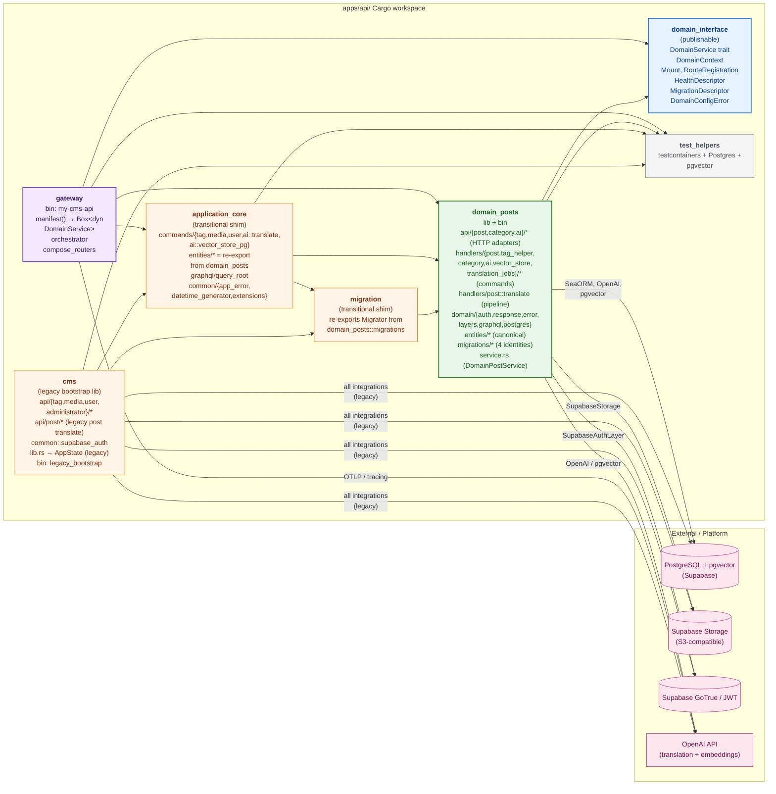
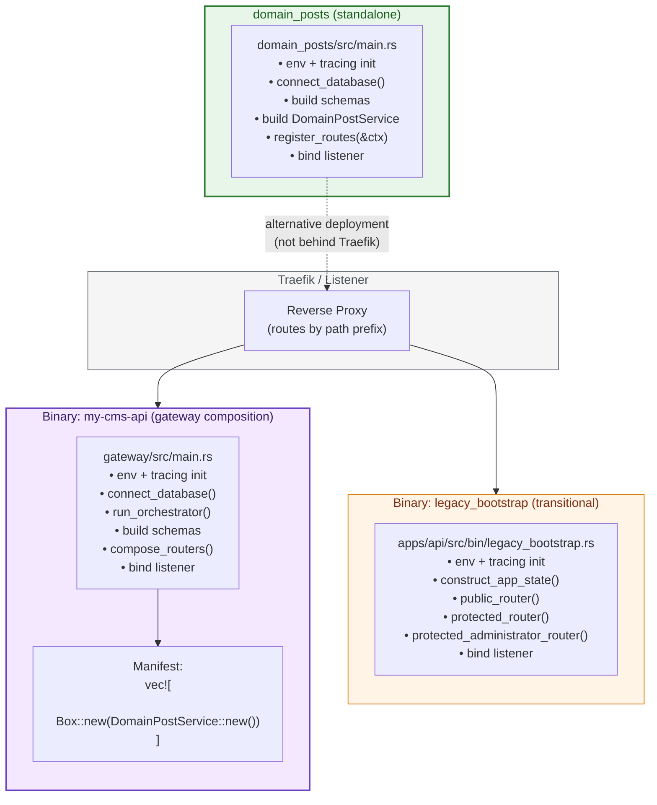
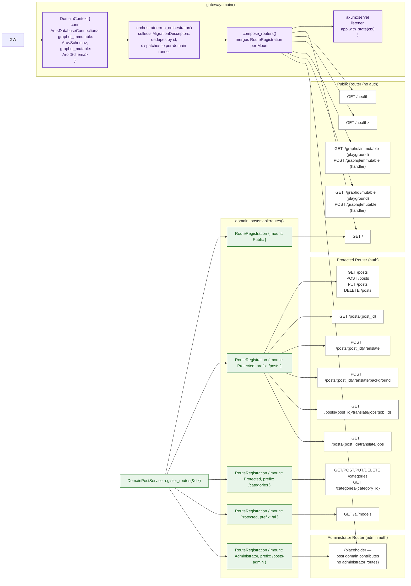
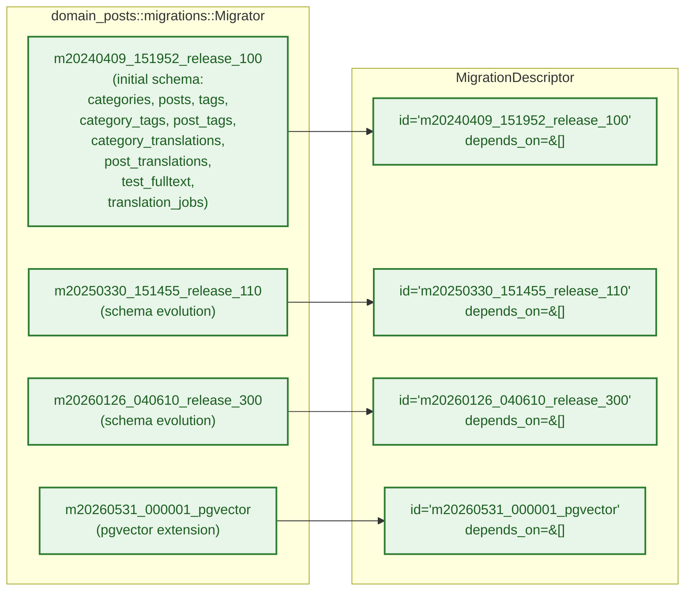
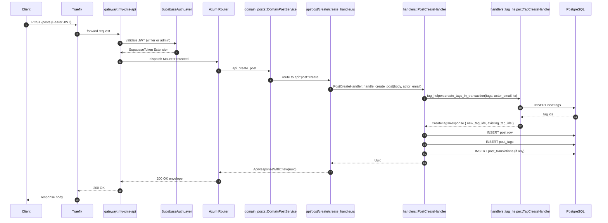
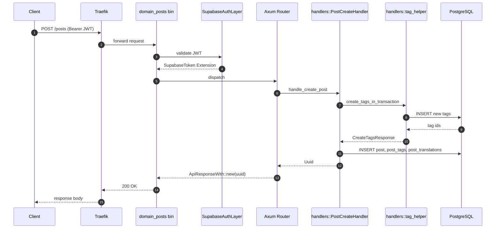
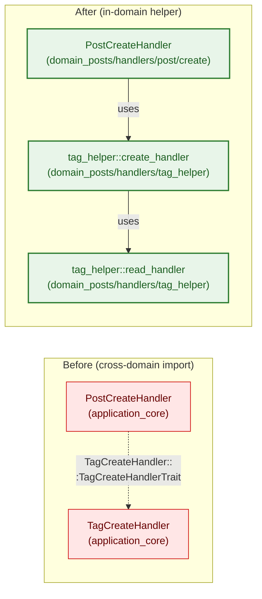
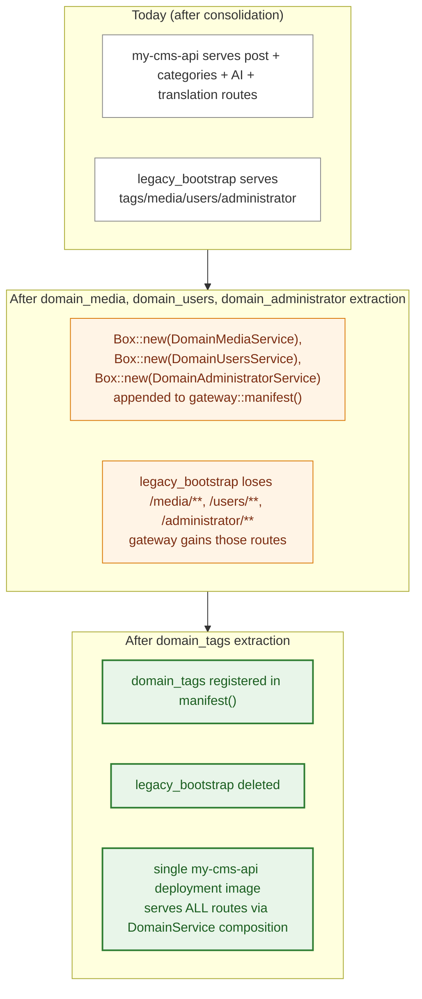

# My-CMS API Architecture (Implemented)

This document captures the **as-built** state of the API architecture after the `refactor-api-into-pluggable-domain-libraries` change. It is the visual companion to `pluggable-domain-refactor.md`.

## 1. Cargo Workspace

## 2. Deployment Modes — Two Binaries

The cutover is staged. Two binaries are produced today:

## 3. Gateway Composition — `my-cms-api`

## 4. Legacy Bootstrap — `legacy_bootstrap`

```mermaid
graph TB
    subgraph lb["apps/api/src/bin/legacy_bootstrap.rs"]
        direction TB
        LSTATE["AppState {<br/>  conn, media_config,<br/>  media_cache, bucket_visibility_cache,<br/>  graphql_immutable_schema,<br/>  graphql_mutable_schema,<br/>  supabase_admin_client<br/>}"]
        LPR["public_router()<br/>+ cors_layer + otel_layers"]
        LPRR["protected_router()<br/>+ auth + cookie + body-limit<br/>+ cors + otel"]
        LPAR["protected_administrator_router()<br/>+ auth + cookie<br/>+ cors + otel"]
        LSERV["axum::serve(listener, app)"]
    end

    subgraph lpublic["Public"]
        LP1["GET /"]
        LP2["GET /health"]
        LP3["GET /healthz"]
        LP4["GET /media/images/{*path}"]
        LP5["GET /media/{*path}"]
        LP6["GET /graphql/immutable<br/>POST /graphql/immutable"]
        LP7["GET /graphql/mutable<br/>POST /graphql/mutable"]
    end

    subgraph lprot["Protected (writer or admin)"]
        LPR2["GET/POST/PUT/DELETE /posts<br/>GET /posts/{post_id}"]
        LPR3["POST /posts/{post_id}/translate<br/>POST /posts/{post_id}/translate/background<br/>GET /posts/{post_id}/translate/jobs/{job_id}<br/>GET /posts/{post_id}/translate/jobs"]
        LPR5["DELETE /tags"]
        LPR6["GET/POST/DELETE /media<br/>GET /media/info/{*path}<br/>DELETE /media/delete/{*path}"]
        LPR7["GET/POST /graphql/mutable"]
    end

    subgraph ladmin["Administrator (admin only)"]
        LA1["POST /administrator/database/migration"]
        LA2["GET/POST /users<br/>GET/PUT/DELETE /users/{user_id}<br/>POST /users/{user_id}/reset-password"]
        LA3["GET/POST /media/buckets<br/>GET/PUT/DELETE /media/buckets/{name}<br/>POST /media/buckets/{name}/empty"]
    end

    LSTATE --> LPR & LPRR & LPAR
    LPR --> LP1 & LP2 & LP3 & LP4 & LP5 & LP6 & LP7
    LPRR --> LPR2 & LPR3 & LPR5 & LPR6 & LPR7
    LPAR --> LA1 & LA2 & LA3
    LPR & LPRR & LPAR --> LSERV

    classDef shim fill:#fff4e6,stroke:#d97706,stroke-width:1px,color:#7c2d12
    classDef route fill:#fff,stroke:#888,stroke-width:1px,color:#333

    class LSTATE,LPR,LPRR,LPAR,LSERV shim
    class LP1,LP2,LP3,LP4,LP5,LP6,LP7,LPR2,LPR3,LPR5,LPR6,LPR7,LA1,LA2,LA3 route
```

## 5. Domain Ownership — `domain_posts` Internals

```mermaid
graph LR
    subgraph dps["apps/api/domain_posts/"]
        direction TB

        subgraph api["src/api/"]
            APIC["post/create/create_handler.rs"]
            APID["post/delete/delete_handler.rs"]
            APIM["post/modify/modify_handler.rs"]
            APIR["post/read/read_handler.rs"]
            APIT["post/translate/translate_handler.rs"]
            APIJ["post/translate/job_handler.rs"]
            APICC["category/{create,read,modify,delete}/*"]
            APII["ai/models/models_handler.rs"]
        end

        subgraph handlers["src/handlers/"]
            HC["post/create/*<br/>(PostCreateHandler)"]
            HD["post/delete/*<br/>(PostDeleteHandler)"]
            HM["post/modify/*<br/>(PostModifyHandler)"]
            HR["post/read/*<br/>(PostReadHandler)"]
            HT["post/translate/*<br/>(PostTranslateHandler)"]
            HV["vector_store/*<br/>(VectorStore)"]
            HTG["tag_helper/{create,read}/*<br/>(TagCreateHandler,<br/>TagReadHandler)"]
            HTT["translation_jobs/*"]
            HCA["category/{create,read,modify,delete}/*<br/>(CategoryCreateHandler,<br/>CategoryReadHandler,<br/>CategoryModifyHandler,<br/>CategoryDeleteHandler)"]
            HAI["ai/models/* + openai_client_from_env<br/>(ModelsHandler,<br/>OpenAIClient factory)"]
        end

        subgraph domain["src/domain/"]
            DERR["error.rs<br/>AppError"]
            DRES["response.rs<br/>ApiResponseWith/Error<br/>ErrorCode, AxumResponse"]
            DAU["auth.rs<br/>SupabaseAuthLayer<br/>SupabaseAuthConfig<br/>SupabaseClaims<br/>SupabaseToken"]
            DLA["layers.rs<br/>cors_layer()<br/>body_limit_layer()<br/>otel_layers()<br/>cookie_layer()"]
            DPG["postgres.rs<br/>connect_database()"]
            DGQ["graphql.rs<br/>contribute_post_schema()<br/>(Seaography schema<br/>with all post entities)"]
            DVS["vector_store.rs<br/>(pgvector adapter)"]
            DEX["extensions.rs<br/>StringExtension<br/>generate_vietnam_now"]
            DEV["env.rs<br/>POST_REQUIRED_ENV"]
        end

        subgraph entities["src/entities/"]
            ENT["posts, post_tags,<br/>post_translations,<br/>translation_jobs,<br/>tags, test_fulltext,<br/>categories, category_tags,<br/>category_translations,<br/>sea_orm_active_enums<br/>(canonical; physically here)"]
        end

        subgraph migrations["src/migrations/"]
            MM["mod.rs<br/>Migrator<br/>POST_MIGRATION_IDS<br/>migration_descriptors()"]
            M1["m20240409_151952_release_100"]
            M2["m20250330_151455_release_110"]
            M3["m20260126_040610_release_300"]
            M4["m20260531_000001_pgvector"]
        end

        subgraph glue["glue"]
            SVC["service.rs<br/>DomainPostService impl<br/>DomainService trait"]
            MCL["migrations_cli.rs<br/>run(), handle_args()"]
            OBS["observability.rs<br/>init()"]
        end
    end

    APIC --> HC
    APID --> HD
    APIM --> HM
    APIR --> HR
    APIT --> HT
    APIJ --> HTT
    APICC --> HCA
    APII --> HAI
    HC -->|uses tag_helper<br/>for tag create-in-tx| HTG
    HT --> HV
    HCA -->|uses tag_helper<br/>for category create-in-tx| HTG
    HT -->|calls openai_client_from_env| HAI
    ENT -. "owns" .-> HC & HD & HM & HR & HT & HTG & HCA & HAI
    MM --> M1 & M2 & M3 & M4
    SVC --> MM
    SVC --> api
    SVC --> DRES & DAU & DERR & DLA & DPG & DGQ
    MCL --> MM

    classDef domain fill:#e8f5e9,stroke:#2e7d32,stroke-width:2px,color:#1b5e20
    classDef reexport fill:#fff4e6,stroke:#d97706,stroke-width:1px,color:#7c2d12

    class APIC,APID,APIM,APIR,APIT,APIJ,APICC,APII,HC,HD,HM,HR,HT,HV,HTG,HTT,HCA,HAI,DERR,DRES,DAU,DLA,DPG,DGQ,DVS,DEX,DEV,MM,M1,M2,M3,M4,SVC,MCL,OBS,ENT domain
    class ERE reexport
```

## 6. Migration Identities — `domain_posts`

> Identities preserved exactly. Database `up` history unchanged.

## 7. Data Flow — POST /posts (Composed Gateway)

## 8. Data Flow — POST /posts (Standalone `domain_posts` Bin)

> Identical request path; only the listener differs. The standalone `domain_posts` bin does not compose other domains.

## 9. Cross-Domain Call — TagHelper Resolution

> `domain_posts` no longer depends on `application_core::commands::tag::*`. The tag create + read handlers are owned by `domain_posts::handlers::tag_helper::*`.

## 10. What Each Binary Actually Serves Today

| Route prefix | `my-cms-api` (gateway) | `legacy_bootstrap` | `domain_posts` (standalone) |
|---|---|---|---|
| `/`, `/health`, `/healthz` | ✅ | ✅ | ✅ |
| `/graphql/immutable`, `/graphql/mutable` | ✅ | ✅ | ❌ |
| `/posts/**`, `/posts/{post_id}` | ✅ | ✅ | ✅ |
| `/posts/{post_id}/translate{,/background}` | ✅ | ✅ | ✅ |
| `/posts/{post_id}/translate/jobs{,/**}` | ✅ | ✅ | ✅ |
| `/categories/**` | ✅ | ❌ | ✅ |
| `/ai/models` | ✅ | ❌ | ✅ |
| `/tags` | ❌ | ✅ | ❌ |
| `/media/**`, `/media/buckets/**`, `/media/info/**`, `/media/delete/**`, `/media/images/**` | ❌ | ✅ | ❌ |
| `/users/**` | ❌ | ✅ | ❌ |
| `/administrator/database/migration` | ❌ | ✅ | ❌ |

> `/categories/**` and `/ai/models` moved from `legacy_bootstrap` to the gateway (`my-cms-api`) and to the standalone `domain_posts` bin per the `consolidate-category-ai-translate-into-domain-posts` change. The `legacy_bootstrap` binary still serves the not-yet-extracted tags/media/users/administrator routes.

## 11. Future Staged Cutover

See `docs/adding-a-domain.md` for the recipe and `docs/pluggable-domain-refactor.md` for the full architectural overview.