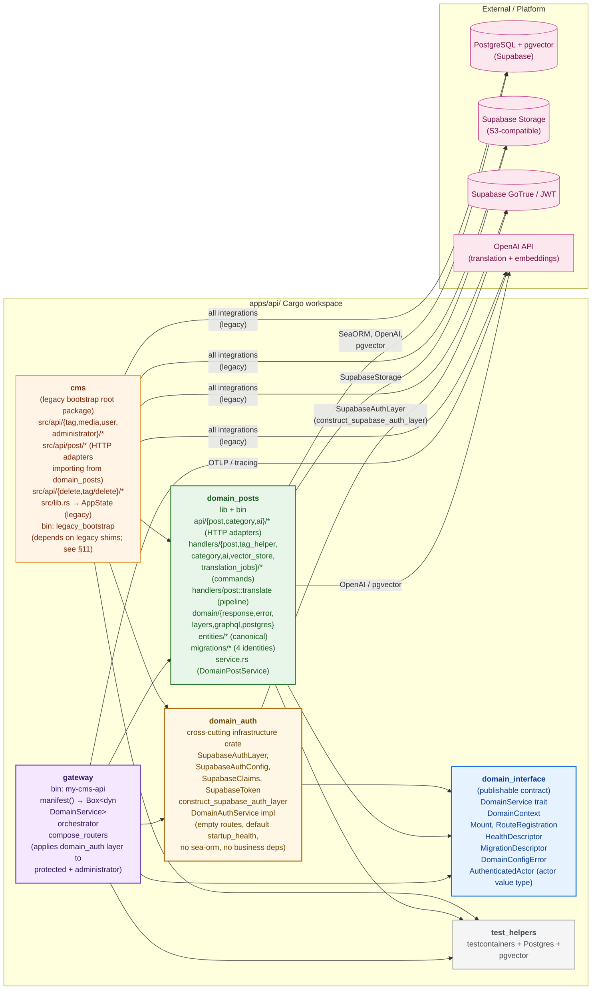
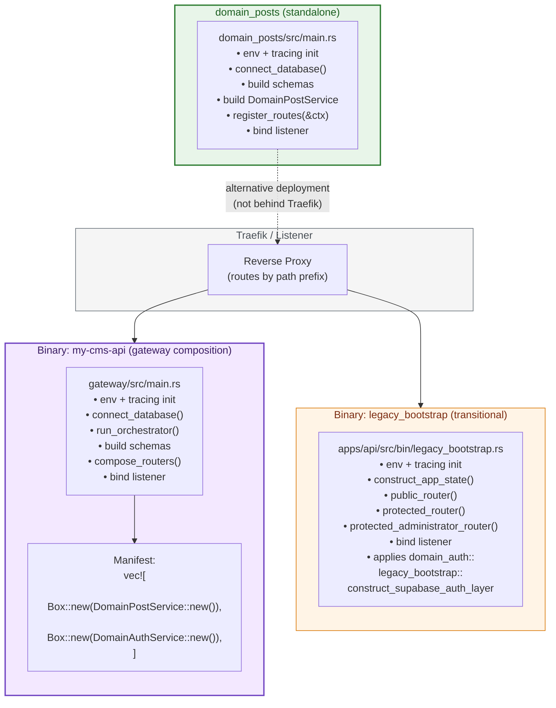
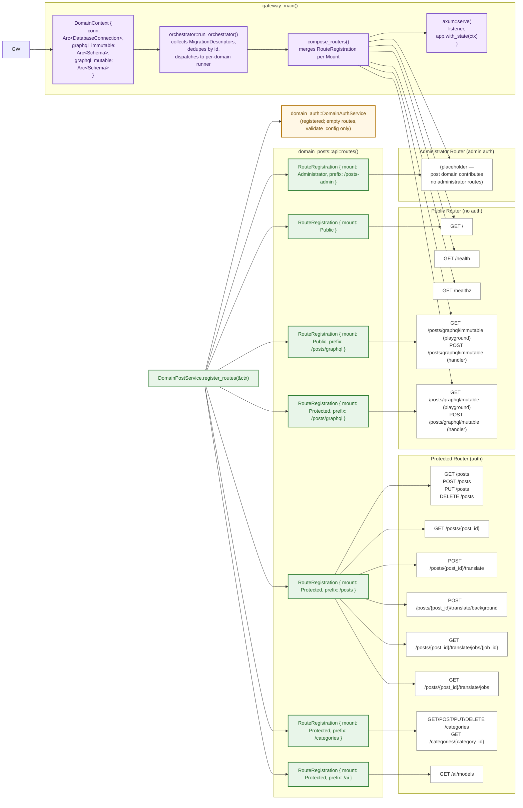
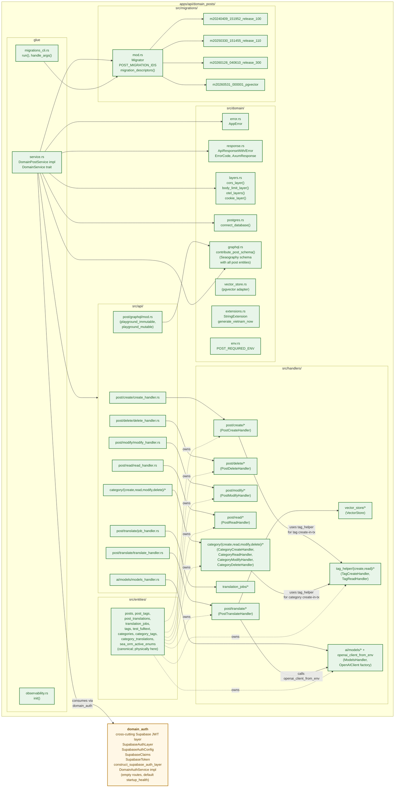
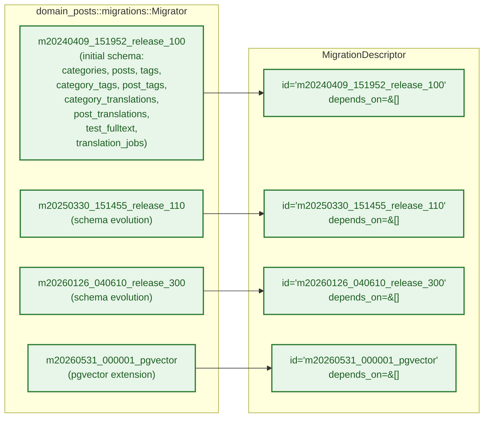
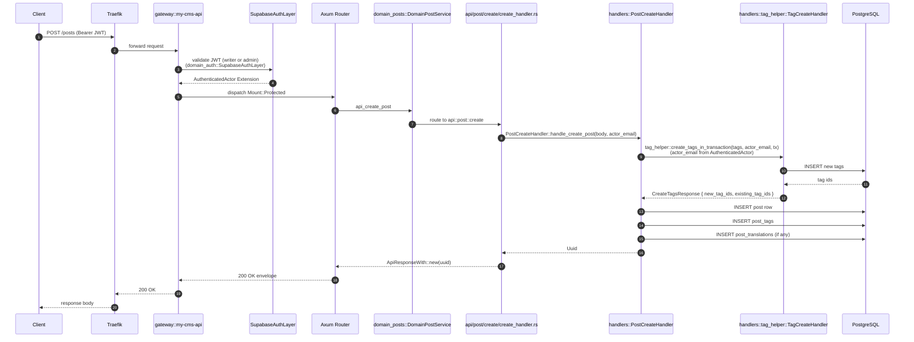
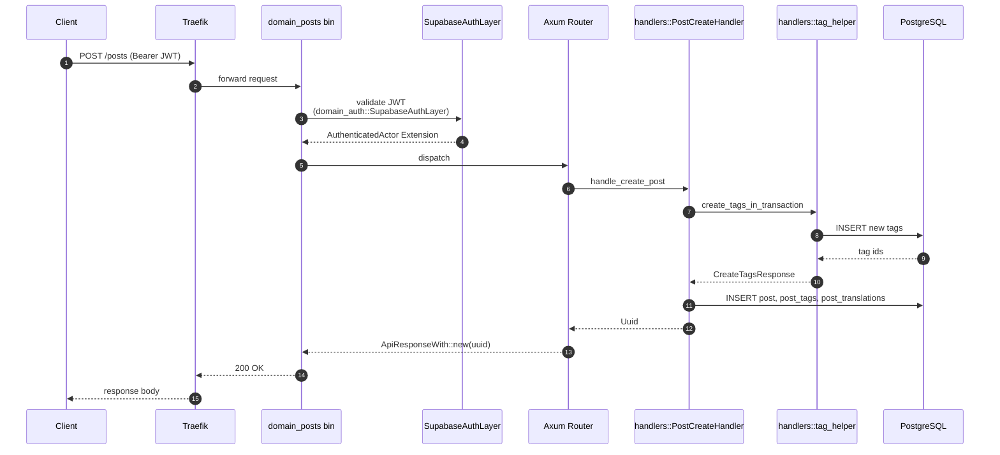
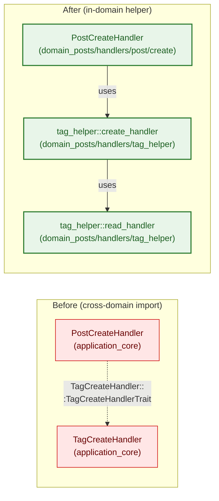
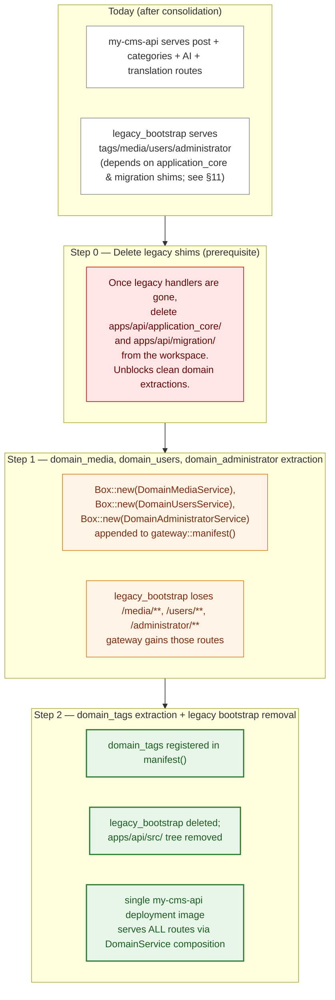

# My-CMS API Architecture (Implemented)

This document captures the **as-built** state of the API architecture after `refactor-api-into-pluggable-domain-libraries`, `consolidate-category-ai-translate-into-domain-posts`, `merge-graphql-into-posts-domain`, and `migrate-legacy-to-domain-posts`. It is the visual companion to `pluggable-domain-refactor.md`.

> **Note on legacy shims (post `migrate-legacy-to-domain-posts`):** `apps/api/application_core/` and `apps/api/migration/` are transitional crates retained only to keep `legacy_bootstrap` compiling. Post, AI translation, vector-store, and pgvector code are **no longer** duplicated inside `application_core` — they live exclusively in `domain_posts`. `application_core::entities` and `apps/api/migration/` are pure re-export shims; `application_core::commands::{post,ai}` have been deleted. Neither crate has architectural responsibility in the current picture. Both remain slated for removal as legacy handlers in tags/media/users/administrator are extracted (see §12).

## 1. Cargo Workspace

**Workspace member legend:**
- **Pluggable domain architecture** (the architecture): `domain_interface`, `domain_auth`, `domain_posts`, `gateway`, `test_helpers`.
- **Legacy bootstrap** (transitional): `cms` root package — retains the `legacy_bootstrap` binary until tags/media/users/administrator are extracted into their own domains.
- **Legacy shims** (no architectural responsibility; see §11): `application_core`, `migration`.

## 2. Deployment Modes — Two Binaries

The cutover is staged. Two binaries are produced today:

## 3. Gateway Composition — `my-cms-api`

## 4. Legacy Bootstrap — `legacy_bootstrap`

```mermaid

graph TB
    subgraph lb["apps/api/src/bin/legacy_bootstrap.rs"]
        direction TB
        LSTATE["AppState {<br/>  conn, media_config,<br/>  media_cache, bucket_visibility_cache,<br/>  graphql_immutable_schema,<br/>  graphql_mutable_schema,<br/>  supabase_admin_client<br/>}"]
        LPR["public_router()<br/>+ cors_layer + otel_layers"]
        LPRR["protected_router()<br/>+ auth (writer or admin)<br/>+ cookie + body-limit<br/>+ cors + otel"]
        LPAR["protected_administrator_router()<br/>+ auth (admin only)<br/>+ cookie + cors + otel"]
        LSERV["axum::serve(listener, app)"]
    end

    subgraph lpublic["Public"]
        LP1["GET /"]
        LP2["GET /health"]
        LP3["GET /healthz"]
        LP4["GET /media/images/{*path}"]
        LP5["GET /media/{*path}"]
        LP6["GET /posts/graphql/immutable<br/>POST /posts/graphql/immutable"]
        LP7["GET /posts/graphql/mutable<br/>POST /posts/graphql/mutable"]
    end

    subgraph lprot["Protected (writer or admin)"]
        LPR2["GET/POST/PUT/DELETE /posts<br/>GET /posts/{post_id}"]
        LPR3["POST /posts/{post_id}/translate<br/>POST /posts/{post_id}/translate/background<br/>GET /posts/{post_id}/translate/jobs/{job_id}<br/>GET /posts/{post_id}/translate/jobs"]
        LPR5["DELETE /tags"]
        LPR6["GET/POST/DELETE /media<br/>GET /media/info/{*path}<br/>DELETE /media/delete/{*path}"]
        LPR7["GET/POST /posts/graphql/mutable"]
    end

    subgraph ladmin["Administrator (admin only)"]
        LA1["POST /administrator/database/migration"]
        LA2["GET/POST /users<br/>GET/PUT/DELETE /users/{user_id}<br/>POST /users/{user_id}/reset-password"]
        LA3["GET/POST /media/buckets<br/>GET/PUT/DELETE /media/buckets/{name}<br/>POST /media/buckets/{name}/empty"]
    end

    LSTATE --> LPR & LPRR & LPAR
    LPR --> LP1 & LP2 & LP3 & LP4 & LP5 & LP6 & LP7
    LPRR --> LPR2 & LPR3 & LPR5 & LPR6 & LPR7
    LPAR --> LA1 & LA2 & LA3
    LPR & LPRR & LPAR --> LSERV

    classDef shim fill:#fff4e6,stroke:#d97706,stroke-width:1px,color:#7c2d12
    classDef route fill:#fff,stroke:#888,stroke-width:1px,color:#333

    class LSTATE,LPR,LPRR,LPAR,LSERV shim
    class LP1,LP2,LP3,LP4,LP5,LP6,LP7,LPR2,LPR3,LPR5,LPR6,LPR7,LA1,LA2,LA3 route
```

## 5. Domain Ownership — `domain_posts` Internals

## 6. Migration Identities — `domain_posts`

> Identities preserved exactly. Database `up` history unchanged.

## 7. Data Flow — POST /posts (Composed Gateway)

## 8. Data Flow — POST /posts (Standalone `domain_posts` Bin)

> Identical request path; only the listener differs. The standalone `domain_posts` bin does not compose other domains.

## 9. Cross-Domain Call — TagHelper Resolution

> `domain_posts` no longer depends on `application_core::commands::tag::*`. The tag create + read handlers are owned by `domain_posts::handlers::tag_helper::*`. The `application_core` references in this diagram are **historical** (pre-`refactor-api-into-pluggable-domain-libraries`) and only exist today as legacy re-exports for the `legacy_bootstrap` path (see §11).

## 10. What Each Binary Actually Serves Today

| Route prefix | `my-cms-api` (gateway) | `legacy_bootstrap` | `domain_posts` (standalone) |
|---|---|---|---|
| `/`, `/health`, `/healthz` | ✅ | ✅ | ✅ |
| `/posts/graphql/immutable`, `/posts/graphql/mutable` | ✅ | ✅ | ✅ |
| `/posts/**`, `/posts/{post_id}` | ✅ | ✅ | ✅ |
| `/posts/{post_id}/translate{,/background}` | ✅ | ✅ | ✅ |
| `/posts/{post_id}/translate/jobs{,/**}` | ✅ | ✅ | ✅ |
| `/categories/**` | ✅ | ❌ | ✅ |
| `/ai/models` | ✅ | ❌ | ✅ |
| `/tags` | ❌ | ✅ | ❌ |
| `/media/**`, `/media/buckets/**`, `/media/info/**`, `/media/delete/**`, `/media/images/**` | ❌ | ✅ | ❌ |
| `/users/**` | ❌ | ✅ | ❌ |
| `/administrator/database/migration` | ❌ | ✅ | ❌ |

> `/categories/**` and `/ai/models` moved from `legacy_bootstrap` to the gateway (`my-cms-api`) and to the standalone `domain_posts` bin per the `consolidate-category-ai-translate-into-domain-posts` change. The `legacy_bootstrap` binary still serves the not-yet-extracted tags/media/users/administrator routes.

> **Note (`merge-graphql-into-posts-domain`):** The GraphQL HTTP surface moved from `/graphql/{immutable,mutable}` to `/posts/graphql/{immutable,mutable}`. The mutable mount now accepts the Supabase app roles `my-headless-cms-writer` and `my-headless-cms-administrator` (the gateway's pre-change administrator-only gate was widened to writer + administrator so all three deployment modes expose identical authorization behaviour). The post domain is the sole owner of the GraphQL playground handlers and the `Arc<Schema>` wiring.

## 11. Legacy Shims — `application_core` & `migration`

Two workspace members exist **only** to keep `legacy_bootstrap` compiling. They have no architectural responsibility in the pluggable domain picture above. They are slated for deletion as the first concrete step in the staged cutover (§12).

### `apps/api/application_core/`

- **Workspace member:** `application_core` (path-dep of the `cms` root package).
- **What it still exposes:**
  - `commands/{tag,media,user}` — handler structs and traits that the legacy handlers in `apps/api/src/api/...` import.
  - `entities/*` — **re-exports** of `domain_posts::entities::*` (the canonical entities live in `domain_posts`; `application_core` only re-exports them for the legacy path).
  - `common/{app_error, datetime_generator, extensions}` — small utilities the legacy handlers depend on.
  - `commands::{post,ai}` were deleted in `migrate-legacy-to-domain-posts`; their canonical replacements live under `domain_posts::handlers::post::*` and `domain_posts::handlers::vector_store::*`.
- **Where it's referenced:** `apps/api/src/bin/legacy_bootstrap.rs`, every legacy handler under `apps/api/src/api/{tag,media,user,...}/*`, and `apps/api/src/api/{delete,tag/delete}/*` (which import `PostDeleteHandler` from `domain_posts`). The legacy `apps/api/src/api/post/*` handlers still exist as thin HTTP adapters but their command-handler imports now point at `domain_posts` (no `application_core::commands::post::*` import remains).
- **Why it still exists:** to avoid a sweeping rewrite of the legacy `apps/api/src/api/...` tree during the pluggable-domain cutover. Each handler will be replaced wholesale as tags/media/users/administrator are extracted into their own domains.

### `apps/api/migration/`

- **Workspace member:** `migration` (path-dep of the `cms` root package and of `test_helpers`).
- **What it still exposes (post `migrate-legacy-to-domain-posts`):**
  - `lib.rs` — `pub use domain_posts::migrations::*; pub use domain_posts::migrations::Migrator;` re-export shim. No migration source files live here.
  - `main.rs` — `cli::run_cli(migration::Migrator).await` entry point for the `migration` standalone binary.
  - The four previously-duplicate migration source files (`m20240409_151952_release_100.rs`, `m20250330_151455_release_110.rs`, `m20260126_040610_release_300.rs`, `m20260531_000001_pgvector.rs`) and `constants.rs` were deleted in `migrate-legacy-to-domain-posts`. The canonical, authoritative copies live in `domain_posts::migrations::*`, so `cargo run -p migration -- migrate --list` still prints the same four migration IDs in the same order.
- **Where it's referenced:** `apps/api/src/bin/legacy_bootstrap.rs` (none), `apps/api/test_helpers/src/lib.rs` (`use migration::{Migrator, MigratorTrait}`), the `migration` standalone binary, and the legacy `/administrator/database/migration` handler.
- **Why it still exists:** the legacy bootstrap ships a `migration` binary that operators can invoke to run schema migrations, and `test_helpers` resolves `Migrator` through this shim. The canonical migrator is `domain_posts::migrations::Migrator`; `migration` is a thin re-export. Once `legacy_bootstrap` and the `/administrator/database/migration` route are removed, the `migration` binary also goes.

### Removal order (see §12)

1. `domain_media` extracted → `application_core::commands::media::*` becomes empty.
2. `domain_users` extracted → `application_core::commands::user::*` becomes empty.
3. `domain_tags` extracted → `application_core::commands::tag::*` becomes empty.
4. `domain_administrator` extracted → the legacy `/administrator/database/migration` route is removed; the `migration` standalone binary is no longer needed and `apps/api/migration/` can be deleted.
5. `apps/api/application_core/` deleted from workspace; `legacy_bootstrap` deleted.
6. `domain_posts` migrator remains the only migrator; the `migration` binary is replaced by `cargo run -p domain_posts --bin migrations_cli` (or the orchestrator's `run_orchestrator()` handles migrations at gateway startup).

## 12. Future Staged Cutover

> **Prerequisite note:** Step 0 must be repeated for each domain extraction — `application_core::commands::<domain>_*` becomes empty as each handler migrates into its new domain crate. The workspace deletion of `application_core` and `migration` only happens after **all** legacy handler trees are gone. The `migration` binary in particular can be deleted once `/administrator/database/migration` and the `legacy_bootstrap` migrator CLI are both removed.

See `docs/adding-a-domain.md` for the recipe and `docs/pluggable-domain-refactor.md` for the full architectural overview.
