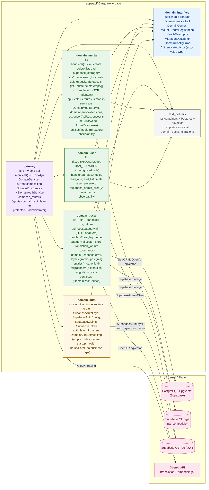
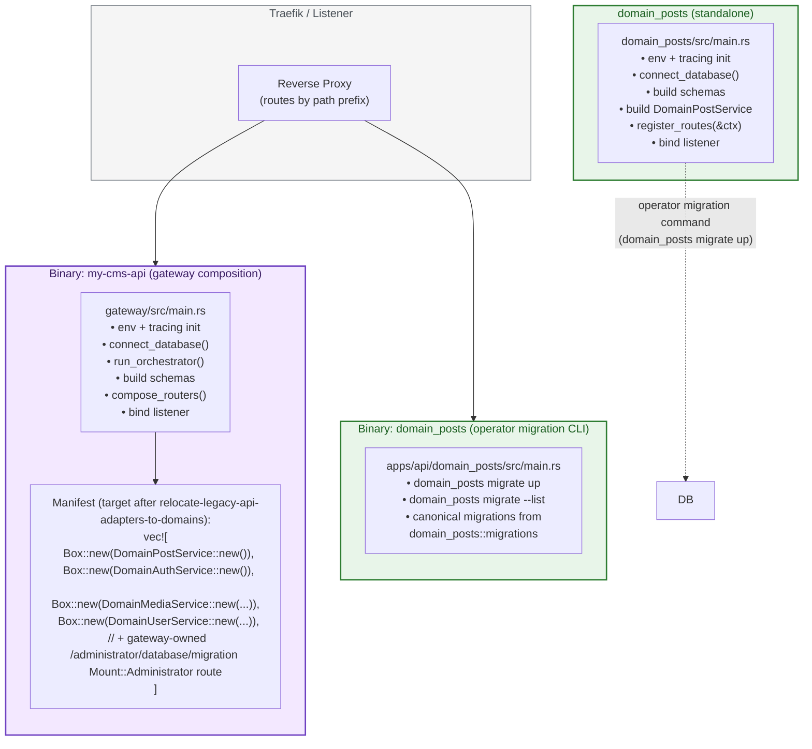
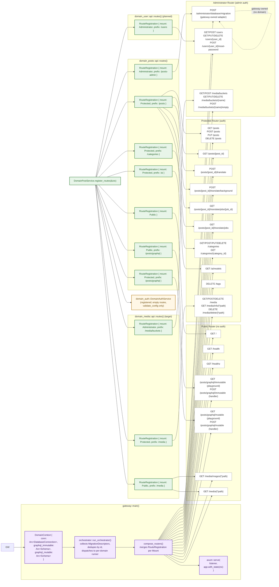
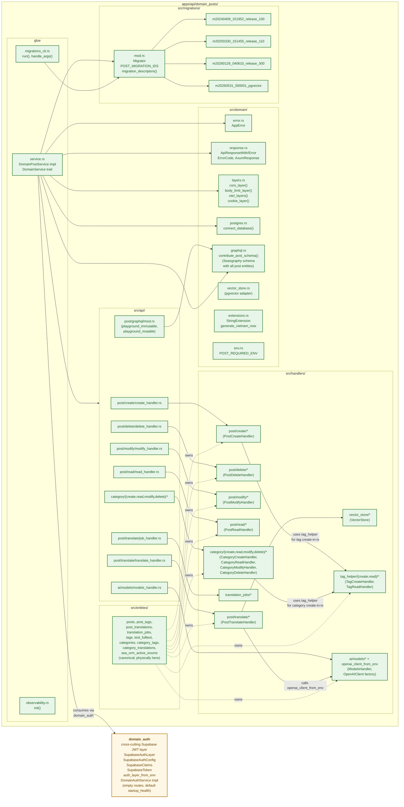
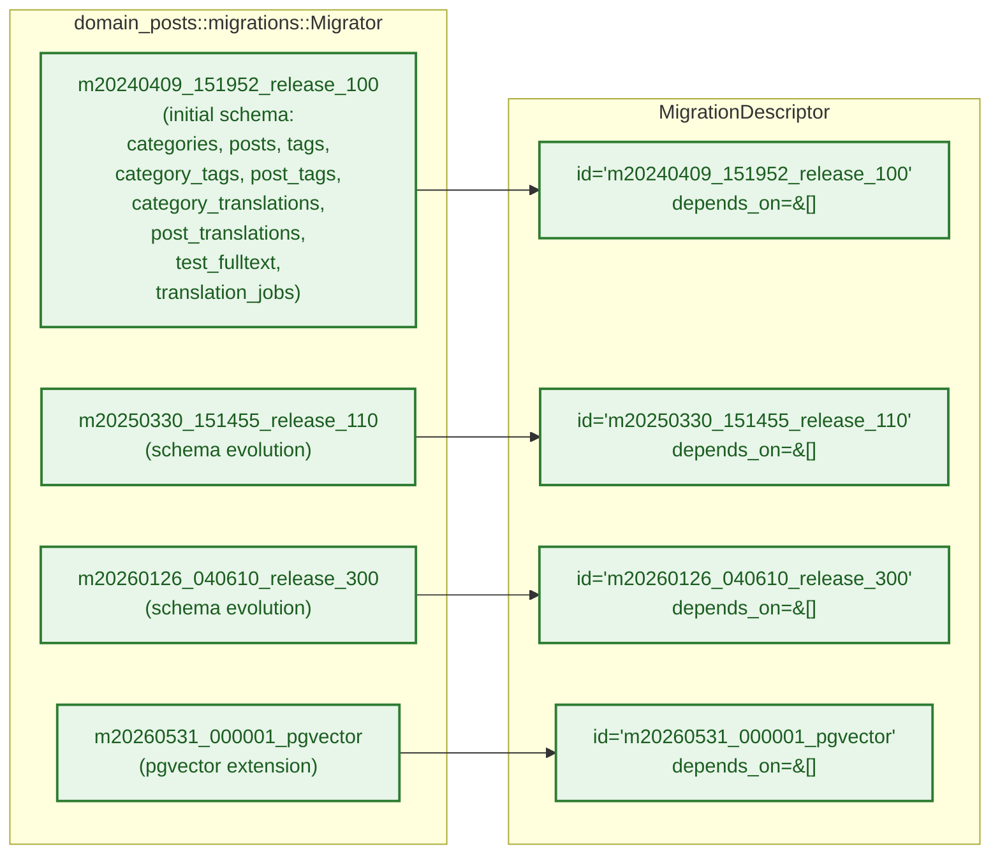
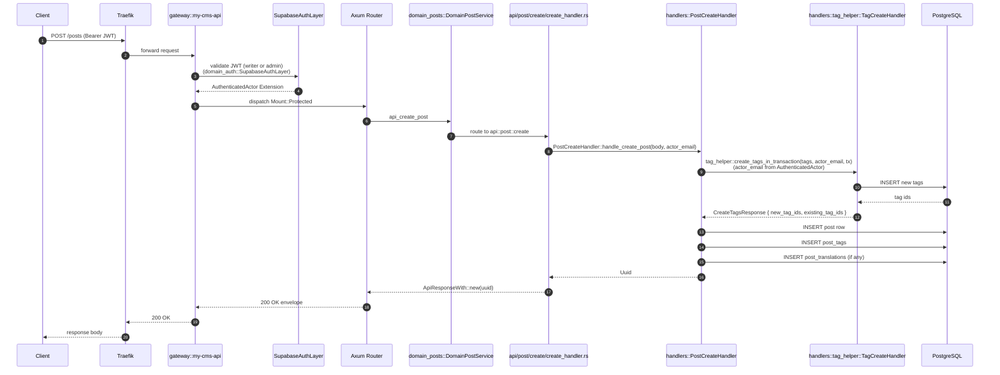
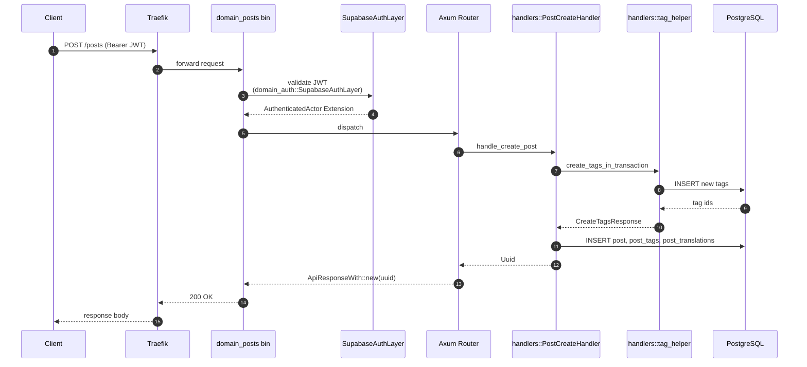
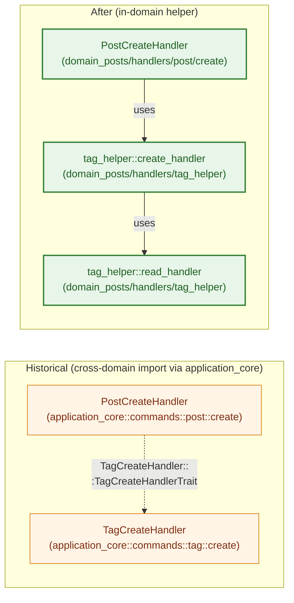
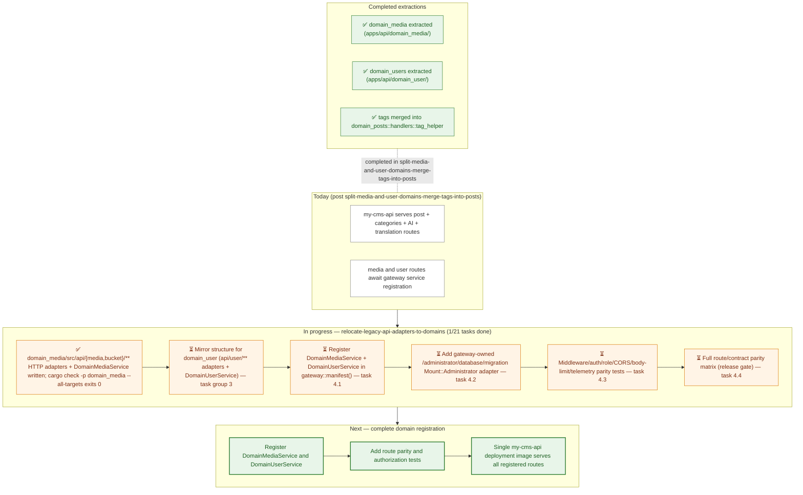

> **Phase A and migration cleanup completed:** `apps/api/application_core/`, the legacy `apps/api/src/**` runtime, and `apps/api/migration/` were removed by [`purge-legacy-cms-and-application-core`](../openspec/changes/purge-legacy-cms-and-application-core/). Canonical migrations remain in `domain_posts`; operators use `domain_posts migrate up`, and `test_helpers` imports `domain_posts::migrations` directly.

 (Implemented + In-Progress)

This document captures the **as-built** state of the API architecture after `refactor-api-into-pluggable-domain-libraries`, `consolidate-category-ai-translate-into-domain-posts`, `merge-graphql-into-posts-domain`, `migrate-legacy-to-domain-posts`, and `split-media-and-user-domains-merge-tags-into-posts`. It is the visual companion to `pluggable-domain-refactor.md`.

> **Current state:** `legacy_bootstrap`, `cms`, `application_core`, and `migration` have been removed. The remaining domain-adapter work is to register media and user services in `gateway::manifest()`; until that follow-up lands, the gateway serves the route surface shown in §10.

> **Note on retired legacy crates:** `application_core`, `migration`, `cms`, and `legacy_bootstrap` are no longer workspace members or runtime artifacts. Post, AI translation, vector-store, pgvector, media, user, and tag business logic remains in the domain crates. The operator migration workflow is `domain_posts migrate up`; canonical migration identities live under `domain_posts::migrations`.

## 1. Cargo Workspace

**Workspace member legend:**
- **Pluggable domain architecture:** `domain_interface`, `domain_auth`, `domain_posts`, `domain_media`, `domain_user`, `gateway`, `test_helpers`.
- **Canonical migrations and operator CLI:** `domain_posts::migrations` and `domain_posts migrate`.
- **Retired:** `cms`, `legacy_bootstrap`, `application_core`, and `migration` are no longer workspace members or runtime artifacts.

## 2. Deployment Modes — API and Migration Binaries

The workspace produces the gateway API binary and the domain-owned migration/operator binary:

## 3. Gateway Composition — `my-cms-api`

## 4. Retired Legacy Runtime

The historical diagram below documents the retired topology only; it is not part of the current workspace or deployment.

```mermaid

graph TB
    subgraph lb["apps/api/src/bin/legacy_bootstrap.rs"]
        direction TB
        LSTATE["AppState {<br/>  conn, media_config,<br/>  media_cache, bucket_visibility_cache,<br/>  graphql_immutable_schema,<br/>  graphql_mutable_schema,<br/>  supabase_admin_client<br/>}"]
        LPR["public_router()<br/>+ cors_layer + otel_layers"]
        LPRR["protected_router()<br/>+ auth (writer or admin)<br/>+ cookie + body-limit<br/>+ cors + otel"]
        LPAR["protected_administrator_router()<br/>+ auth (admin only)<br/>+ cookie + cors + otel"]
        LSERV["axum::serve(listener, app)"]
    end

    subgraph lpublic["Public"]
        LP1["GET /"]
        LP2["GET /health"]
        LP3["GET /healthz"]
        LP4["GET /media/images/{*path}"]
        LP5["GET /media/{*path}"]
        LP6["GET /posts/graphql/immutable<br/>POST /posts/graphql/immutable"]
        LP7["GET /posts/graphql/mutable<br/>POST /posts/graphql/mutable"]
    end

    subgraph lprot["Protected (writer or admin)"]
        LPR2["GET/POST/PUT/DELETE /posts<br/>GET /posts/{post_id}"]
        LPR3["POST /posts/{post_id}/translate<br/>POST /posts/{post_id}/translate/background<br/>GET /posts/{post_id}/translate/jobs/{job_id}<br/>GET /posts/{post_id}/translate/jobs"]
        LPR5["DELETE /tags"]
        LPR6["GET/POST/DELETE /media<br/>GET /media/info/{*path}<br/>DELETE /media/delete/{*path}"]
        LPR7["GET/POST /posts/graphql/mutable"]
    end

    subgraph ladmin["Administrator (admin only)"]
        LA1["POST /administrator/database/migration"]
        LA2["GET/POST /users<br/>GET/PUT/DELETE /users/{user_id}<br/>POST /users/{user_id}/reset-password"]
        LA3["GET/POST /media/buckets<br/>GET/PUT/DELETE /media/buckets/{name}<br/>POST /media/buckets/{name}/empty"]
    end

    LSTATE --> LPR & LPRR & LPAR
    LPR --> LP1 & LP2 & LP3 & LP4 & LP5 & LP6 & LP7
    LPRR --> LPR2 & LPR3 & LPR5 & LPR6 & LPR7
    LPAR --> LA1 & LA2 & LA3
    LPR & LPRR & LPAR --> LSERV

    classDef shim fill:#fff4e6,stroke:#d97706,stroke-width:1px,color:#7c2d12
    classDef route fill:#fff,stroke:#888,stroke-width:1px,color:#333

    class LSTATE,LPR,LPRR,LPAR,LSERV shim
    class LP1,LP2,LP3,LP4,LP5,LP6,LP7,LPR2,LPR3,LPR5,LPR6,LPR7,LA1,LA2,LA3 route
```

## 5. Domain Ownership — `domain_posts` Internals

## 6. Migration Identities — `domain_posts`

> Identities preserved exactly. Database `up` history unchanged.

## 7. Data Flow — POST /posts (Composed Gateway)

## 8. Data Flow — POST /posts (Standalone `domain_posts` Bin)

> Identical request path; only the listener differs. The standalone `domain_posts` bin does not compose other domains.

## 9. Cross-Domain Call — TagHelper Resolution

> `domain_posts` no longer depends on `application_core::commands::tag::*`. The tag create + read handlers are owned by `domain_posts::handlers::tag_helper::*`. The `application_core` references in this diagram are **historical** (pre-`refactor-api-into-pluggable-domain-libraries`); the `application_core` crate was retired by [`purge-legacy-cms-and-application-core`](../openspec/changes/purge-legacy-cms-and-application-core/) (see §11).

## 10. What Each Binary Actually Serves Today

| Route prefix | `my-cms-api` (gateway) | `domain_posts` (standalone) |
|---|---|---|
| `/`, `/health`, `/healthz` | ✅ | ✅ |
| `/posts/graphql/immutable`, `/posts/graphql/mutable` | ✅ | ✅ |
| `/posts/**`, `/posts/{post_id}` | ✅ | ✅ |
| `/posts/{post_id}/translate{,/background}` | ✅ | ✅ |
| `/posts/{post_id}/translate/jobs{,/**}` | ✅ | ✅ |
| `/categories/**` | ✅ | ✅ |
| `/ai/models` | ✅ | ✅ |
| `/tags` | 🟡 | ❌ |
| `/media/**`, `/media/buckets/**`, `/media/info/**`, `/media/delete/**`, `/media/images/**` | 🟡 | ❌ |
| `/users/**` | 🟡 | ❌ |
| `/administrator/database/migration` | 🟡 | ❌ |
| `domain_posts migrate up` | operator CLI | operator CLI |

> 🟡 = domain adapters exist but the corresponding service is not yet registered in `gateway::manifest()`. No legacy runtime serves these routes.

> **Note (`merge-graphql-into-posts-domain`):** The GraphQL HTTP surface moved from `/graphql/{immutable,mutable}` to `/posts/graphql/{immutable,mutable}`. The mutable mount now accepts the Supabase app roles `my-headless-cms-writer` and `my-headless-cms-administrator` (the gateway's pre-change administrator-only gate was widened to writer + administrator so all three deployment modes expose identical authorization behaviour). The post domain is the sole owner of the GraphQL playground handlers and the `Arc<Schema>` wiring.

> **Historical note (`split-media-and-user-domains-merge-tags-into-posts`):** media, user, and tag business logic was extracted into domain crates. Their gateway registration remains follow-up work; the former `apps/api/src/api/**` adapters and `legacy_bootstrap` runtime were deleted.

## 11. Retired Compatibility Crates

`application_core` and `migration` have been deleted. Their former responsibilities now live in the domain crates:

- canonical SeaORM entities and migrations: `apps/api/domain_posts/src/entities/` and `apps/api/domain_posts/src/migrations/`;
- operator migration CLI: `apps/api/domain_posts/src/main.rs` via `domain_posts migrate`;
- test migration access: `apps/api/test_helpers/src/lib.rs` imports `domain_posts::migrations` directly.

No compatibility re-export or standalone legacy migration crate remains.

## 12. Domain Cutover — In Progress

The legacy runtime purge is complete. The remaining follow-up is registering the already-extracted media and user services in the gateway; migration ownership and operator execution are already domain-owned.

> **Remaining work:** Register `DomainMediaService` and `DomainUserService` in `gateway::manifest()`, then add route, authorization, and deployment parity tests. The migration CLI is already `domain_posts migrate up`; no legacy migration crate remains.

See `docs/adding-a-domain.md` for the recipe and `docs/pluggable-domain-refactor.md` for the full architectural overview.
