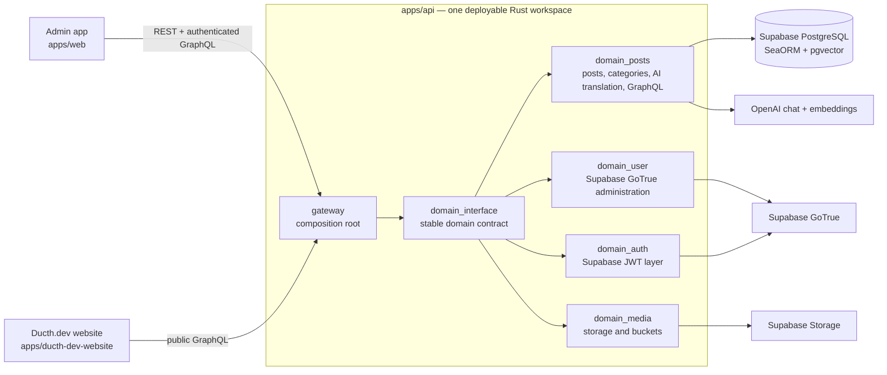

# Software architecture

## Architectural position

My-CMS is a modular monolith. It is deployed as one Rust API process, but its
business capabilities live in independent domain crates. The `gateway` is a
thin composition root, not the place for feature logic. Domains can evolve
independently while operations, authentication, and the public API retain one
coherent boundary.



The public website and admin are separate React/RSBuild applications. They
share API content and the rendered-article contract, but are independently
built and deployed.

## Backend composition

`apps/api/gateway/src/main.rs` creates a `Vec<Box<dyn DomainService>>` at
startup. The current manifest registers:

| Domain | Responsibility | External state |
| --- | --- | --- |
| `domain_posts` | Posts, categories, tags, translations, AI model catalogue, jobs, REST and GraphQL | CMS PostgreSQL and OpenAI |
| `domain_auth` | Supabase JWT-layer configuration | Supabase authentication configuration |
| `domain_media` | Media upload/read/delete and bucket management | Supabase Storage |
| `domain_user` | Administrative user operations | Supabase GoTrue management API |

The gateway owns process-level work:

1. Load environment and build shared dependency objects.
2. Connect one SeaORM database pool and build immutable and mutable GraphQL
   schemas once.
3. Ask every domain to validate configuration and perform startup health checks.
4. Gather each domain's migration descriptors and dispatch its migrations.
5. Merge the domains' bare routers by mount type.
6. Apply the shared cookie manager and role-aware authentication layers, then
   bind the HTTP listener.

The domain interface in `apps/api/domain_interface/src/lib.rs` is intentionally
small. A domain implements `DomainService` to declare its identity, required
environment, migrations, health behavior, and route registrations. It receives
`DomainContext`, which holds the shared database pool and the two already-built
GraphQL schemas. The interface contains no feature entities, command handlers,
or generated models.

## Route and authorization model

Every domain returns `RouteRegistration` values with one of three mount types.
The gateway merges the router first, then applies the policy exactly once:

| Mount | Who can call it | Examples |
| --- | --- | --- |
| Public | Anyone | `/`, `/health`, `/healthz`, immutable post GraphQL |
| Protected | Supabase `writer` or `administrator` role | Post/category CRUD, post translation, AI model list, mutable post GraphQL |
| Administrator | Supabase `administrator` role | Domain-owned administration routes such as bucket and user management |

Domains must not add their own global authentication or cookie layers. Keeping
routers bare prevents a route receiving a different security envelope depending
on where it is composed. The gateway currently applies the cookie manager and
Supabase role layers; new process-wide concerns belong at that same boundary.

`domain_posts` owns its HTTP surface, including
`/posts/graphql/immutable` (public) and `/posts/graphql/mutable` (protected).
The gateway builds shared schemas, while the post domain registers their HTTP
mounts. This keeps API ownership with the domain and process composition with
the gateway.

## Domain internals

`domain_posts` follows a clear inward flow:

```text
Axum adapter (api/) → command/query handler (handlers/) →
domain support (domain/) → SeaORM entity or external integration
```

HTTP adapters extract Axum state and request data, call a handler, and return
the project response envelope. Business rules, database operations, OpenAI
calls, and translation validation belong in handlers/domain—not in gateway or
route definitions. Migrations and SeaORM entities remain owned by the domain
that owns the data.

`domain_media` and `domain_user` encapsulate their own API state. The gateway
constructs that state once, so caches and HTTP clients are shared for the life
of the process rather than recreated per request.

## Data and integration boundaries

- CMS relational data lives in Supabase PostgreSQL and is accessed through
  SeaORM from its owning domain.
- Authentication uses Supabase JWTs. User administration uses the Supabase
  service-role client, which must remain server-side.
- Media bytes and bucket policy live in Supabase Storage.
- `domain_posts` can call OpenAI for translation chat completions and
  embeddings. The optional `pgvector` extension stores translation embeddings
  in PostgreSQL for high-similarity reuse.

An unavailable pgvector extension does not prevent the API migration from
completing: the embeddings table is skipped and translation continues without
semantic reuse. A missing `OPENAI_API_KEY`, by contrast, prevents the post
domain from passing configuration validation.

## Rules for extending the system

Add a new capability as a domain only when it has a coherent ownership boundary
(routes, state, migrations, and health behavior). Add its `DomainService`
implementation, then register it in the gateway manifest. Do not import its
handlers or entities into the gateway.

Cross-domain transactions and feature dependencies need an explicit OpenSpec
design first. A shared database pool does not make database tables shared
ownership. Keep the owning domain responsible for its schema, commands,
validation, and migrations; use a designed integration point for everything
else.

Before implementation, record a non-trivial change in `openspec/` and follow
the [agent-team workflow](../development/agent-team.md).
