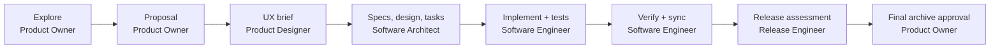

# Agent-team workflow

## Why the team is structured this way

My-CMS uses role-based agents as a delivery system, not as interchangeable
chatbots. Each role owns a different class of decision and artifact. This
reduces two common failures: implementation starting before the product and
architecture are agreed, and multiple agents editing the same specification or
source file concurrently.

`AGENTS.md` is the authoritative operating contract. This document is the
short working map for contributors.



## Roles and ownership

| Role | Owns | Does not own |
| --- | --- | --- |
| Product Owner (PO) | User outcome, scope, success criteria, `proposal.md`, final product sign-off | Source-code implementation and API design |
| Product Designer (PD) | Responsive UX, information architecture, accessibility, visual and interaction guidance | Backend contracts and shared OpenSpec artifact writes unless assigned as the single writer |
| Software Architect (SA) | Source-backed architecture analysis, API/data contracts, specs, `design.md`, `tasks.md` | Product-priority decisions and application implementation |
| Software Engineer (SE) | Task execution, tests, code review/impact analysis, verification evidence | Release authorization and product scope changes |
| Release Engineer (RE) | Deployment readiness, rollout/rollback, post-deploy checks, release handoff | Unapproved production changes |

The coordinator owns task routing and final synthesis. A collaborator who finds
a decision outside its role returns it to the owning role rather than silently
expanding scope.

## The delivery lifecycle

### 1. Explore

The PO clarifies outcome and scope. The PD may assess experience and
accessibility; the SA may map feasibility. This phase is read-only: no source
code or permanent OpenSpec artifact is written. Check `openspec list --json`
first so active work is not duplicated.

### 2. Propose and design

OpenSpec is the source of truth for *what* changes and *why*. The normal,
serialized handoff is:

1. PO writes `proposal.md`.
2. PD provides an implementation-ready UX brief.
3. SA writes delta specs, integrates the UX brief into `design.md`, and writes
   checkbox-based `tasks.md`.

One person or agent writes a shared artifact at a time. The SA validates the
affected architecture before finalizing design: use the code-review graph
workflow when available, otherwise document the limitation and inspect the
repository directly. Implementation starts only once OpenSpec reports that the
required artifacts are ready.

### 3. Implement

The SE reads the active change under `openspec/changes/<change-name>/` and
walks `tasks.md` in order. Behavioral changes use RED–GREEN–REFACTOR. For
independent work, subagents can work in parallel, but there is always a single
writer for each file.

Before editing and after each task group, the SE performs impact review with the
code-review graph workflow when available. If it is unavailable, use `git diff`
plus focused source inspection and record that substitution. Mark a task
complete only after its stated verification passes.

The regular verification gate is:

```bash
cargo check
cargo test
cargo fmt -- --check
cargo clippy
pnpm --dir apps/web build
```

Run additional frontend or package checks whenever the changed surface needs
them—for example, build and test Ducth.dev and `packages/editor-prose` after a
reader-contract change.

### 4. Verify, release, archive

The SE verifies requirement coverage and design coherence, syncs delta specs to
canonical specs, and supplies implementation plus operational-impact evidence to
the RE. The RE decides whether deployment action is required and documents
rollout, rollback trigger, and post-deploy verification. It never runs
environment-changing production commands without explicit user or release
authorization. The PO supplies final archive approval.

The OpenSpec sequence is:

```text
verify → sync specs → archive change
```

Only then should the executing agent offer branch disposition: merge, PR, keep,
or discard. Never force-push protected history.

## Routing a request

Classify the dominant intent before acting:

| Request type | Primary role | Typical result |
| --- | --- | --- |
| Explore, clarify, decide whether to build | PO | Shared understanding and success criteria |
| Propose a change | PO | OpenSpec proposal |
| Design UX or extract design language | PD | Responsive, accessible implementation brief |
| Map/design an API or write specs/tasks | SA | Architecture map and OpenSpec design artifacts |
| Implement, fix, debug | SE | Code, tests, and evidence |
| Release/deploy | RE | Authorized release plan or readiness finding |
| Verify/archive | SE, then RE and PO as needed | Verification, sync, archive decision |
| Explain or update general docs | Coordinator directly | Source-backed answer or documentation edit |

A fast fix is allowed only when it changes one non-generated file, changes at
most 40 non-generated lines, preserves behavior, avoids
auth/API/schema/dependency/deployment/secret/OpenSpec work, and has a focused
verification command. If any condition is uncertain, treat it as normal change
work.

## Handoff format

Every handoff states:

- **Goal** — the one-sentence deliverable.
- **Context** — source paths, OpenSpec artifacts, commands, and decisions
  already examined.
- **Constraints** — scope limits, non-goals, files not to touch, and required
  verification.
- **Done when** — observable acceptance criteria and the command(s) that prove
  them.

Report evidence inspected, decisions made, artifacts changed, verification run,
assumptions or risks, unresolved questions, and the next owner. This preserves
traceability from product outcome through UX, requirement, technical design,
implementation, and release.
