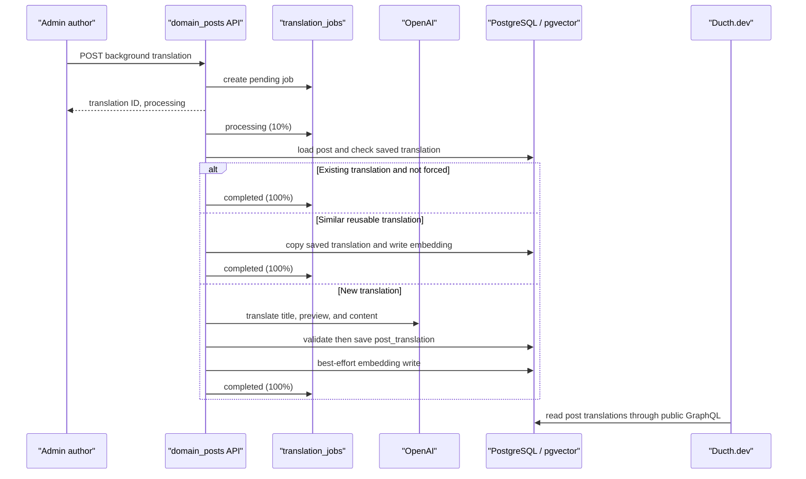

# AI translation

## Purpose and scope

AI translation creates a localized version of an existing post. It translates the
title, preview, and HTML article content, stores the result in
`post_translations`, and makes it available to the public site. It is a
post-domain feature; category translations are authored through normal category
editing and are not generated by this pipeline.

The implementation spans:

- Admin workflow: `apps/web/src/app/admin/blogs/blog-form.tsx`
- API routes: `apps/api/domain_posts/src/api/post/translate/`
- Translation handler: `apps/api/domain_posts/src/handlers/post/translate/`
- Embedding store: `apps/api/domain_posts/src/handlers/vector_store/`
- Public fallback: `apps/ducth-dev-website/src/lib/i18n/getLocalizedPost.ts`

## Author workflow

Translation is available for an existing post, because it requires a post ID.
In the admin post form, an author chooses **AI Translate**, selects an unused
target language and an AI model, then starts a background translation. The
admin polls active jobs every three seconds and reloads the post after those
jobs finish. A target language with a pending or processing job cannot be
started again.

**Re-translate** sends the same background request for an existing localized
version with `forceRetranslate: true` and a selected model.

## HTTP contract

All translation routes are protected: callers must have the writer or
administrator role through the gateway.

| Method and route | Use | Result |
| --- | --- | --- |
| `POST /posts/{post_id}/translate` | Synchronous translation | Returns a translation ID with `completed` status |
| `POST /posts/{post_id}/translate/background` | Normal admin workflow | Creates a job and returns its ID with `processing` status |
| `GET /posts/{post_id}/translate/jobs` | Poll active work | Lists `pending` and `processing` jobs |
| `GET /posts/{post_id}/translate/jobs/{job_id}` | Inspect a job | Returns status, progress, model, timestamps, and error message |
| `GET /ai/models` | Populate model chooser | Returns the curated model catalogue |

The request body is camel-cased:

```json
{
  "targetLanguage": "vi",
  "forceRetranslate": false,
  "model": "gpt-4o-mini"
}
```

The server requires `OPENAI_API_KEY`. If no model is supplied, it uses
`gpt-4o-mini`.

## Processing flow



The background task transitions `pending → processing → completed` on success
or `pending → processing → failed` on error. Its persisted progress values are
currently coarse—`0`, `10`, and `100`—so they are status signals rather than
per-chunk progress.

## Translation decision order

For a normal request (`forceRetranslate: false`), the handler:

1. Reuses a translation already saved for the same post and language.
2. If a vector store is available, searches other translations with embedding
   similarity at least `0.95`, then copies the matching localized content.
3. Otherwise calls OpenAI and saves a new translation.

For a forced request, the handler calls OpenAI first. Only after that succeeds
does it delete the existing translation and insert the replacement. This keeps
the prior translation available if the model call fails, although the
delete-then-insert step is not yet one database transaction.

## HTML fidelity and quality safeguards

Posts are authored as TipTap HTML, so preserving article structure is part of
correctness. The prompt asks the model to preserve tags, attributes, and
structure; translate all text; and retain source paragraph coverage. Large
content is split into roughly 2,000-character chunks: HTML is split around
parsed top-level structure where possible, while plain text is split at sentence
boundaries. Chunks translate concurrently and are reassembled in source order.

Before a translated row is written, the handler checks paragraph coverage. A
translation that drops too many source paragraphs fails validation and must not
replace a valid row. Editors should still review terminology, links, and the
rendered article before publishing: AI output is content assistance, not an
approval workflow.

## Optional semantic reuse

When PostgreSQL has the `vector` extension, the migration creates the
`embeddings` table and a cosine IVFFlat index. The system embeds the title plus
up to 8,000 characters of translated content using `text-embedding-3-small`.
An embedding write failure is logged but does not fail an otherwise successful
translation. If pgvector is unavailable, migration skips the embeddings table
and translation falls back to the database/OpenAI path.

Some legacy log comments still say “Qdrant”; the running implementation uses
pgvector in PostgreSQL, not Qdrant.

## Public-site resolution and safety

Ducth.dev queries a post and translations over immutable GraphQL. For the
selected language, it uses the translated title and preview when present, and
uses translated content only when its HTML has a paragraph tag; otherwise it
falls back to source content. This prevents a known incomplete headings-only
translation from being published.

The result is rendered by `ArticleProse` with `dangerouslySetInnerHTML`.
Translation and editor output must therefore be trusted, sanitized CMS content.
Do not introduce untrusted HTML sources without server-side sanitization and a
documented allowlist.
