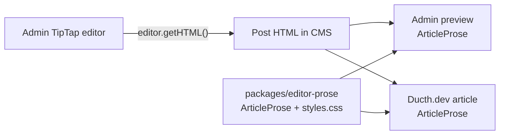

# Editor prose contract

## What this solves

The admin writes post content with TipTap, while Ducth.dev renders that saved
HTML to readers. `packages/editor-prose` is the shared **read-only rendering
contract** between those applications. It provides one React wrapper and one
stylesheet, so the admin preview and the public article use the same semantic
HTML wrapper and extension coverage.



It does **not** make the editable canvas and reader surface identical. The admin
needs selection, resize handles, placeholders, toolbar, fullscreen, and other
authoring affordances; those remain in admin-specific TipTap CSS. The shared
package defines how the saved document should look when read.

## Package API

`packages/editor-prose/src/ArticleProse.tsx` exports:

```tsx
<ArticleProse html={post.content} />
```

It emits exactly:

```html
<div class="article-prose">…saved HTML…</div>
```

The stylesheet is a separate export:

```ts
import { ArticleProse } from 'editor-prose';
import 'editor-prose/styles.css';
```

Both consuming applications use the local `file:../../packages/editor-prose`
dependency. The public app imports its stylesheet once in
`apps/ducth-dev-website/src/App.tsx`. The admin imports it in the TipTap editor
module, where the preview uses `ArticleProse`.

## Coverage and HTML contract

The shared stylesheet uses `.article-prose` as its only root. It covers standard
article HTML plus the TipTap extensions currently enabled in the admin editor:

| Content | Persisted form / selector |
| --- | --- |
| Headings, paragraphs, links, quotations, lists | Semantic HTML inside `.article-prose` |
| Inline and block code | `code`, `pre`, and syntax-highlighted child markup |
| Images and figures | `img`, `figure`, `figcaption` |
| Tables | `table.tiptap-table` |
| Task lists | `ul[data-type="taskList"]`, `li[data-type="taskItem"]` |
| Underline, strike, highlight | `u`, `s`, `mark` |
| Subscript and superscript | `sub`, `sup` |
| Video embeds | `iframe` and `.iframe-wrapper` |

The contract deliberately does not use Tailwind Typography classes such as
`prose` or `prose-lg`. That avoids each application getting a different
reader experience from its Tailwind setup, and keeps persisted HTML free of
presentation classes that do not describe the document.

## Theme-token boundary

`article-prose.css` consumes CSS custom properties, including `--space-*`,
`--fg`, `--ink-deep`, `--accent`, `--surface`, `--border`, `--muted`,
`--bg`, and display/mono font variables. The **consumer** owns the visual
theme and must provide compatible values; the package owns typographic rhythm,
semantic element behavior, and extension selectors.

This lets Ducth.dev present its editorial brand and the admin retain a
DaisyUI-oriented shell without duplicating document-element rules. A missing
token is a consumer-integration defect, not a reason to fork shared styles.

### Current parity status

The two apps already share the same wrapper and reader selectors, but they do
not yet have complete visual parity. Ducth.dev defines the package's editorial
tokens in `apps/ducth-dev-website/src/App.css`; `apps/web/src/App.css` currently
does not define that `--space-*` / editorial-token set. Consequently, the admin
preview imports the shared rules but can resolve some values differently or not
at all. The shared module is structurally shared today, not a guarantee that
the admin preview matches the public brand pixel-for-pixel.

If parity is required, add a small compatibility token layer in the admin
application that maps the package's required custom properties to the admin
theme (for example DaisyUI variables). Keep `.article-prose` selectors in the
package; do not copy them into either application.

## Working in the admin

`TipTapEditor` configures the editor extensions, serializes with
`editor.getHTML()`, and exposes a preview modal using `ArticleProse`. Its
`tiptap-editor.css` is intentionally separate from the package and owns:

- editor container, toolbar, focus states, and fullscreen behavior;
- placeholder and selection styling;
- resizable table/image interaction affordances;
- editor-canvas sizing and UI needed while authors change content.

When adding an editor extension, decide first whether it changes saved HTML. If
it does, add the corresponding reader selector and test fixture to the shared
package in the same change. Styling it only in the editable canvas is not
sufficient—the public page receives the saved markup too.

## Change and verification workflow

1. Change the saved-markup contract or rendering rule in
   `packages/editor-prose/`.
2. Extend the package fixture/test with representative TipTap output from the
   new extension.
3. Verify the admin preview and public post tests. Existing consumer tests
   assert the shared wrapper and full TipTap fixture in both apps.
4. Build both applications before merging. Since this is a local `file:`
   package, refresh local installation if the package manager does not pick up
   the change automatically.

The wrapper assigns HTML through `dangerouslySetInnerHTML`; it does not
sanitize content. Preserve the editor/server trust boundary described in
[AI translation](ai-translation.md) and do not pass untrusted HTML directly to
this component.
